# Поток данных: Сервер ↔ Клиент

Диаграмма описывает взаимодействие между клиентом и сервером в Slime Arena.

## Диаграмма последовательности

```mermaid
sequenceDiagram
    autonumber
    box Client
        participant UI as UI (Preact)
        participant Input as InputManager
        participant Render as Renderer
        participant Smooth as SmoothingSystem
    end
    
    box rgb(40, 40, 60) Server (Colyseus)
        participant Room as ArenaRoom
        participant Sim as Simulation<br/>(30 ticks/s)
        participant State as GameState<br/>(Schema)
    end

    %% === ПОДКЛЮЧЕНИЕ ===
    Note over UI, State: 🔗 Подключение к комнате
    UI->>Room: joinOrCreate("arena", { joinToken })
    Room->>Room: onAuth() — валидация токена
    Room->>State: Создать Player
    Room-->>UI: Room joined
    Room-->>Render: balance (BalanceConfig)

    %% === ВЫБОР КЛАССА ===
    Note over UI, State: 🎮 Выбор класса
    UI->>Room: selectClass { classId, name }
    Room->>State: player.classId = classId<br/>player.abilitySlot0 = dash|shield|pull

    %% === ИГРОВОЙ ЦИКЛ ===
    Note over UI, State: 🎯 Игровой цикл (30 Hz)
    
    rect rgb(20, 30, 40)
        Note right of Input: Клиент: ввод и рендер
        Input->>Input: Joystick / Keyboard
        Input->>Room: input { seq, moveX, moveY, abilitySlot? }
        Room->>State: player.inputX/Y = moveX/Y<br/>player.abilitySlotPressed = slot
    end

    rect rgb(30, 40, 20)
        Note right of Sim: Сервер: симуляция тика
        Sim->>Sim: preprocessInputs()
        Sim->>Sim: physicsSystem()
        Sim->>Sim: collisionSystem()
        Sim->>Sim: abilitySystem()
        Sim->>Sim: deathSystem()
        Sim->>Sim: orbSystem()
        Sim->>Sim: updatePhase()
        Sim->>State: Обновить все позиции,<br/>массы, флаги
    end

    rect rgb(40, 30, 50)
        Note right of State: Colyseus: автосинхронизация
        State-->>Smooth: onStateChange() — дельта
        Smooth->>Smooth: captureSnapshot()
        Smooth->>Smooth: Интерполяция<br/>между снапшотами
        Smooth->>Render: renderState
        Render->>UI: syncPlayerState()<br/>syncLeaderboard()
    end

    %% === ТАЛАНТЫ И УМЕНИЯ ===
    Note over UI, State: 🃏 Выбор талантов / умений
    State-->>UI: pendingTalentCard (3 варианта)
    UI->>Room: talentChoice { choice: 0|1|2 }
    Room->>State: Применить талант,<br/>обновить модификаторы
    
    State-->>UI: pendingAbilityCard (слот открыт)
    UI->>Room: cardChoice { choice: 0|1|2 }
    Room->>State: player.abilitySlot1/2 = выбор

    %% === КОНЕЦ МАТЧА ===
    Note over UI, State: 🏆 Результаты
    Sim->>State: phase = "Results"
    State-->>UI: timeRemaining = 0
    UI->>UI: Показать ResultsScreen
    
    UI->>Room: selectClass (replay)
    Room->>State: Сброс игрока для нового матча
```

## Описание потока данных

### 1. Подключение

- Клиент вызывает `joinOrCreate("arena")` с токеном аутентификации
- Сервер валидирует токен в `onAuth()` и создаёт `Player` в `GameState`
- Клиент получает конфигурацию баланса

### 2. Сообщения от клиента к серверу

| Сообщение | Данные | Назначение |
|-----------|--------|------------|
| `input` | `{ seq, moveX, moveY, abilitySlot? }` | Движение + активация умения |
| `selectClass` | `{ classId, name }` | Выбор класса слайма |
| `talentChoice` | `{ choice: 0\|1\|2 }` | Выбор таланта из карточки |
| `cardChoice` | `{ choice: 0\|1\|2 }` | Выбор умения для слота |

### 3. Серверная симуляция (30 тиков/с)

Порядок систем в каждом тике (фиксирован для детерминизма):

1. `preprocessInputs()` — нормализация ввода, применение deadzone
2. `physicsSystem()` — движение, инерция, трение
3. `collisionSystem()` — столкновения слаймов, укусы
4. `abilitySystem()` — умения, снаряды, мины
5. `deathSystem()` — смерть и респаун
6. `orbSystem()` — пузыри и сундуки
7. `updatePhase()` — фазы матча (Growth → Hunt → Final → Results)

### 4. Синхронизация состояния

- **Colyseus Schema** автоматически синхронизирует дельты состояния
- Клиент получает `onStateChange` и сохраняет снапшоты в буфер
- **SmoothingSystem** интерполирует между снапшотами для плавного рендера
- UI обновляется через `syncPlayerState()`, `syncLeaderboard()`

### 5. Ключевые принципы

| Принцип | Описание |
|---------|----------|
| **Сервер — источник истины** | Клиент не отправляет позиции, урон или массу |
| **Детерминизм** | Случайность только через `Rng` с фиксированным сидом |
| **Буфер снапшотов** | Клиент хранит историю состояний для интерполяции |
| **Валидация ввода** | `seq` отклоняет устаревшие пакеты, вектор нормализуется |

## Связанные файлы

- [server/src/rooms/ArenaRoom.ts](../../server/src/rooms/ArenaRoom.ts) — серверная комната
- [server/src/rooms/schema/GameState.ts](../../server/src/rooms/schema/GameState.ts) — схема состояния
- [client/src/main.ts](../../client/src/main.ts) — клиентская логика
- [shared/src/types.ts](../../shared/src/types.ts) — общие типы (`InputCommand`)
