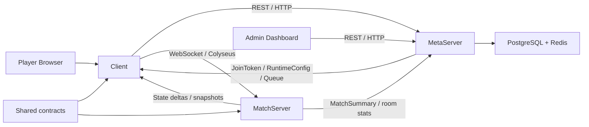

# Slime Arena — Architecture Overview

**Статус:** current-state overview  
**Дата:** 2026-04-22  
**Версия кода:** `v0.8.7`  
**Основные источники:** `README.md`, `.memory_bank/*`, `server/src/index.ts`, `server/src/meta/server.ts`, `server/src/rooms/ArenaRoom.ts`, `server/src/rooms/schema/GameState.ts`, `shared/src/config.ts`, `shared/src/types.ts`

## Краткое резюме

Slime Arena — это [**Monorepo**](#glossary-monorepo) real-time multiplayer browser game с разделением на [**Client**](#glossary-client), [**MatchServer**](#glossary-matchserver), [**MetaServer**](#glossary-metaserver), [**Shared**](#glossary-shared) и `admin-dashboard`. Архитектурно система построена как [**Authoritative Server**](#glossary-authoritative-server): клиент отправляет только [**InputCommand**](#glossary-inputcommand), сервер хранит и рассчитывает [**GameState**](#glossary-gamestate), а игровые параметры централизованы в [**BalanceConfig**](#glossary-balanceconfig).

Документ фиксирует текущее состояние architecture на уровне system overview. Он не заменяет полный пакет `docs/soft-launch/SlimeArena-Architecture-v4.2.5-Part*.md`, а даёт компактную карту системы для входа в проект, архитектурного review и дальнейшей декомпозиции.

## 1. Цели

### 1.1 Архитектурные цели

1. [MUST] Система MUST обеспечивать deterministic server-side simulation с фиксированным `tickRate = 30 Hz`.
2. [MUST] Система MUST сохранять жёсткое разделение ответственности: gameplay rules на `MatchServer`, meta/application logic на `MetaServer`, rendering и input на `Client`.
3. [MUST] Gameplay tuning MUST управляться через `config/balance.json` и типизированный `BalanceConfig`, а не через разрозненные runtime-константы.
4. [SHOULD] Архитектура SHOULD поддерживать mobile-first browser usage без зависимости от platform-specific runtime.
5. [SHOULD] Система SHOULD поддерживать degraded mode, при котором core match runtime продолжает работать даже при частичной недоступности meta-services.
6. [MAY] Архитектура MAY быть развёрнута как split runtime с независимым масштабированием `MatchServer` и `MetaServer`.

### 1.2 Нефункциональные ориентиры

| Атрибут | Требование |
| --- | --- |
| Determinism | [MUST] Одинаковый input при одинаковом seed MUST приводить к одинаковому simulation outcome |
| Responsiveness | [SHOULD] Клиент SHOULD скрывать сетевую задержку через prediction и smoothing |
| Traceability | [MUST] Match result payload MUST содержать `matchId`, `configVersion`, `buildVersion` |
| Extensibility | [SHOULD] Новые gameplay systems SHOULD подключаться как отдельные tick-stage modules |
| Operability | [SHOULD] Runtime SHOULD поддерживать health-check, graceful shutdown и internal control endpoints |

## 2. Контекст

### 2.1 Product context

Slime Arena реализует короткие PvP-матчи длительностью `180 sec` с фазами `Growth -> Hunt -> Final -> Results`. Игрок управляет слаймом через joystick-driven input, собирает массу, использует abilities, получает talents и завершает матч с post-match results.

### 2.2 System context

### 2.3 Контекст развёртывания

1. `Client` обслуживается как browser application.
2. `MatchServer` поднимает Colyseus room runtime и internal HTTP endpoints.
3. `MetaServer` поднимает REST API для auth, matchmaking, profile, rewards, leaderboard и admin flows.
4. `PostgreSQL` хранит durable данные.
5. `Redis` используется для cache и runtime coordination в meta-layer.

## 3. Компоненты

### 3.1 Основные runtime-компоненты

| Компонент | Роль | Технологии | Граница ответственности |
| --- | --- | --- | --- |
| [**Client**](#glossary-client) | Input, UI, rendering, local smoothing | TypeScript, Vite, Preact, Signals, Canvas 2D, `colyseus.js` | Не принимает gameplay decisions |
| [**MatchServer**](#glossary-matchserver) | Authoritative gameplay simulation | Node.js, TypeScript, Colyseus, Express | Не содержит shop/profile/payment logic |
| [**MetaServer**](#glossary-metaserver) | Auth, config, matchmaking, profile, rewards, admin | Node.js, TypeScript, Express | Не симулирует бой |
| [**Shared**](#glossary-shared) | Shared types, config contracts, formulas | TypeScript | Единый контракт client/server |
| `admin-dashboard` | Operations UI | Vite, Preact | Работает поверх Meta API |

### 3.2 Workspace-структура

| Путь | Содержимое | Назначение |
| --- | --- | --- |
| `client/` | browser runtime | UI, input, rendering, session bootstrap |
| `server/` | backend runtime | `MatchServer` и `MetaServer` |
| `shared/` | reusable contracts | types, config, formulas, helpers |
| `admin-dashboard/` | admin UI | control plane for ops |
| `config/` | runtime configuration | balance, experiments |
| `docs/` | architecture and product docs | source documentation |

### 3.3 Основные backend-сервисы

| Service group | Назначение |
| --- | --- |
| `auth` | login, OAuth, guest flow, token handling |
| `config` / `configAdmin` | runtime config delivery и config management |
| `matchmaking` | queue orchestration и room assignment |
| `profile` | player profile и session-facing user data |
| `wallet`, `shop`, `payment`, `ads` | monetization layer |
| `analytics` | gameplay and business telemetry |
| `match-results`, `leaderboard` | post-match progression и ranking |
| `admin` | operational endpoints |

## 4. Детали

### 4.1 Архитектурные границы

1. [MUST] `Client` MUST отправлять intent, а не authoritative world state.
2. [MUST] `MatchServer` MUST быть единственным источником истины для positions, mass, damage, cooldowns и match phase.
3. [MUST] `MetaServer` MUST быть единственным owner для auth, profile, wallet, shop, leaderboard и admin flows.
4. [MUST] Shared contracts MUST жить в `shared/`, чтобы исключать type drift между runtime-слоями.
5. [SHOULD] Internal integration между `MetaServer` и `MatchServer` SHOULD проходить через narrow explicit APIs и service tokens.

### 4.2 Client bootstrap flow

1. `Client` поднимает UI shell и bootstrap state.
2. Выполняется auth initialization через `authService`.
3. При наличии OAuth callback клиент обрабатывает redirect-result и восстанавливает session state.
4. Клиент загружает runtime config через `configService`.
5. После bootstrap UI переводится в `menu`.
6. При старте матча клиент либо использует matchmaking flow через `MetaServer`, либо подключается напрямую к `MatchServer` в fallback-сценарии.

### 4.3 Match connection flow

1. Клиент получает `joinToken` или room assignment.
2. Клиент вызывает `joinOrCreate("arena", ...)`.
3. `ArenaRoom.onAuth()` валидирует payload и формирует auth context.
4. `ArenaRoom.onJoin()` создаёт `Player` и добавляет его в `GameState.players`.
5. Клиент отправляет `selectClass`.
6. `ArenaRoom` назначает class-specific ability slot и переводит игрока в active match lifecycle.

### 4.4 Tick pipeline

`ArenaRoom` использует fixed simulation interval и обрабатывает systems в стабильном порядке.

1. В начале тика сервер увеличивает `serverTick` и вызывает `updateMatchPhase()`.
2. Если матч уже завершён, сервер выполняет только `updateOrbsVisual()`, `updatePlayerFlags()` и `reportMetrics()`, после чего завершает тик без полной simulation.
3. В обычном тике сервер последовательно вызывает `collectInputs()` и `applyInputs()`.
4. Затем выполняются ранние systems прогрессии и подготовки состояния: `boostSystem()`, `abilitySystem()`, `abilityCardSystem()`, `talentCardSystem()`, `updateOrbs()`, `updateChests()`, `toxicPoolSystem()`, `slowZoneSystem()`.
5. После этого выполняются movement- и physics-системы: `flightAssistSystem()`, `physicsSystem()`, `collisionSystem()`.
6. Затем обрабатываются combat и deployable systems: `projectileSystem()`, `mineSystem()`, `chestSystem()`, `statusEffectSystem()`, `zoneEffectSystem()`.
7. В конце тика выполняются lifecycle-системы: `deathSystem()`, `hungerSystem()`, `safeZoneSystem()`, `rebelSystem()`, `updatePlayerFlags()`, `reportMetrics()`.
8. Изменённый `GameState` затем синхронизируется клиентам механизмом Colyseus; отдельного `SnapshotSystem` в текущем `ArenaRoom.onTick()` нет.

| Порядок | Модули | Назначение |
| --- | --- | --- |
| 1 | `updateMatchPhase` | Обновление match phase и timers |
| 2 | `collectInputs`, `applyInputs` | Нормализация и применение player intent |
| 3 | `boostSystem`, `abilitySystem` | Boost lifecycle, cooldowns, queued ability activation |
| 4 | `abilityCardSystem`, `talentCardSystem` | Обработка card/talent choice flows |
| 5 | `updateOrbs`, `updateChests`, `toxicPoolSystem`, `slowZoneSystem` | Обновление world pickups и pre-movement effect state |
| 6 | `flightAssistSystem`, `physicsSystem`, `collisionSystem` | Assist, kinematics, collision resolution |
| 7 | `projectileSystem`, `mineSystem`, `chestSystem`, `statusEffectSystem`, `zoneEffectSystem` | Combat, deployables, status and zone effects |
| 8 | `deathSystem`, `hungerSystem`, `safeZoneSystem`, `rebelSystem`, `updatePlayerFlags` | Lifecycle, map pressure, flags |
| 9 | `reportMetrics` | Runtime observability и profiling |
| 10 | Colyseus state sync | Рассылка изменённого `GameState` без отдельного onTick-stage module |

### 4.5 Client-side smoothing and rendering

1. `Client` получает Colyseus state deltas.
2. Локальная visual layer хранит отдельное render-state представление.
3. Smoothing system применяет prediction по velocity и catch-up correction.
4. Canvas renderer отрисовывает world state.
5. UI layer синхронизирует HUD, leaderboard, cooldowns и phase indicators.

| Слой | Назначение |
| --- | --- |
| `input/` | joystick, pointer, keyboard input |
| `game/` | game loop orchestration и smoothing |
| `rendering/` | world rendering primitives |
| `ui/` | screens, overlays, HUD bridge |
| `services/` | auth, config, matchmaking integration |

### 4.6 Data contracts

#### 4.6.1 `InputCommand`

| Поле | Тип | Назначение |
| --- | --- | --- |
| `seq` | `number` | Sequence number для отбрасывания stale input |
| `moveX` | `number` | Горизонтальный компонент movement intent |
| `moveY` | `number` | Вертикальный компонент movement intent |
| `abilitySlot` | `number?` | Requested ability activation |
| `talentChoice` | `number?` | Choice для talent/card flow |

#### 4.6.2 `GameState`

| Группа | Поля |
| --- | --- |
| Match meta | `phase`, `timeRemaining`, `serverTick`, `rebelId`, `matchId`, `shutdownAt` |
| Core entities | `players`, `orbs`, `chests`, `projectiles`, `mines` |
| World entities | `zones`, `obstacles`, `hotZones`, `slowZones`, `toxicPools`, `safeZones` |
| Presentation/meta | `leaderboard` |

#### 4.6.3 `Player`

| Группа | Основные поля |
| --- | --- |
| Identity | `id`, `name`, `spriteId`, `classId` |
| Motion | `x`, `y`, `vx`, `vy`, `angle`, `angVel` |
| Progression | `mass`, `level`, `killCount`, `talentsAvailable` |
| Combat/status | `flags`, `biteResistPct`, `boostType`, `boostEndTick`, `boostCharges` |
| Abilities | `abilitySlot0..2`, `abilityLevel0..2`, cooldown ticks |
| Card state | `pendingAbilityCard`, `pendingTalentCard`, queue counters |

#### 4.6.4 `MatchSummary`

| Поле | Назначение |
| --- | --- |
| `matchId` | Stable match identifier |
| `mode` | Match mode |
| `startedAt`, `endedAt` | Lifecycle timestamps |
| `configVersion` | Balance/config traceability |
| `buildVersion` | Runtime traceability |
| `playerResults[]` | Placement, mass, kills, deaths, class |
| `matchStats` | Aggregate match stats |

### 4.7 Configuration model

`BalanceConfig` является главным gameplay contract между design docs и runtime.

| Блок | Назначение |
| --- | --- |
| `server` | tick rate, cooldown timing, max players |
| `match` | duration, phases, restart timing |
| `physics`, `worldPhysics` | movement и collision parameters |
| `controls` | joystick и input behavior |
| `slimeConfigs`, `classes`, `combat`, `death` | core gameplay |
| `abilities`, `talents`, `boosts`, `chests` | match progression и combat variation |
| `zones`, `safeZones`, `obstacles`, `hotZones`, `toxicPools` | environment systems |
| `rewards` | post-match XP/coins/rating |

1. [MUST] Новый gameplay parameter MUST сначала появляться в `BalanceConfig`, если он влияет на tuning.
2. [SHOULD] Runtime code SHOULD зависеть от resolved config, а не от hardcoded literals.
3. [MAY] Visual-only параметры MAY оставаться в client-specific config sections, если они не влияют на authoritative simulation.

### 4.8 Internal service integration

`MatchServer` и `MetaServer` связаны двусторонне, но по разным ролям.

1. `MetaServer` выдаёт auth/matchmaking artifacts для клиента.
2. `MatchServer` принимает игроков и ведёт бой.
3. `MatchServer` публикует room stats и match results обратно в `MetaServer`.
4. `MetaServer` обновляет meta progression и leaderboard.
5. `Admin Dashboard` работает только через `MetaServer`.

### 4.9 Критические архитектурные свойства

| Свойство | Что обеспечивает | Почему это важно |
| --- | --- | --- |
| Authoritative simulation | Серверное принятие решений | Anti-cheat и fairness |
| Fixed timestep | Repeatable tick behavior | Determinism |
| Shared contracts | Single type surface | Снижение contract drift |
| Config-driven balance | Fast tuning | Низкая стоимость балансных изменений |
| Split runtime roles | Clear ownership | Поддерживаемость и масштабирование |

## 5. Открытые вопросы

1. `Memory Bank` частично ссылается на GDD `3.3.2`, а `activeContext` уже указывает GDD `3.4.0`. Какую версию считать canonical для overview-документов верхнего уровня?
2. Корневой `package.json` содержит `version: 0.8.6`, тогда как workspace packages уже находятся на `0.8.7`. Нужна ли единая release/version policy для всего Monorepo?
3. Текущий `client/src/main.ts` совмещает bootstrap, session orchestration, rendering wiring и часть UI coordination. Нужен ли отдельный refactor composition root?
4. `MatchServer` и `MetaServer` физически живут в одном workspace `server/`. Следует ли в будущем выделить их в независимые packages/deploy units?

## 6. Глоссарий

### Monorepo
Репозиторий, в котором несколько runtime и library packages развиваются как единая система.

### Client
Browser runtime, отвечающий за UI, input capture, rendering, session bootstrap и взаимодействие с backend.

### MatchServer
Backend runtime с authoritative gameplay simulation и Colyseus rooms.

### MetaServer
Backend runtime для auth, matchmaking, config delivery, profile, rewards, leaderboard и admin API.

### Shared
Общий слой типов, формул и config contracts, используемый клиентом и сервером.

### Authoritative Server
Архитектурный принцип, при котором сервер принимает финальные решения о состоянии мира и не доверяет клиентским вычислениям.

### InputCommand
Сетевой контракт, которым клиент отправляет server-side runtime только intent, а не готовый результат simulation.

### GameState
Синхронизируемое состояние комнаты, включающее match meta, entities и presentation-facing fields.

### BalanceConfig
Централизованный конфигурационный объект gameplay и simulation parameters.
