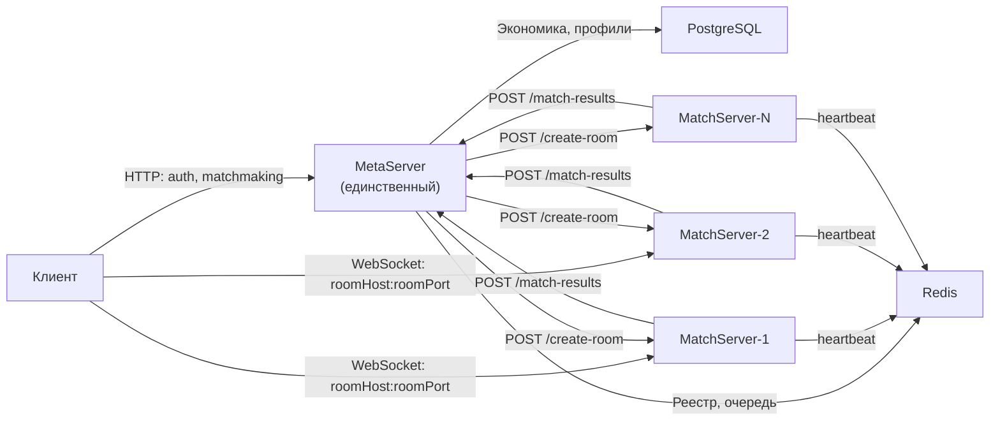
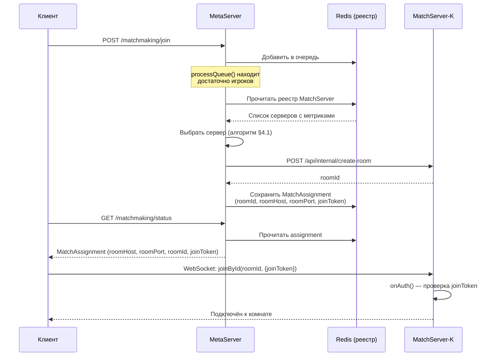
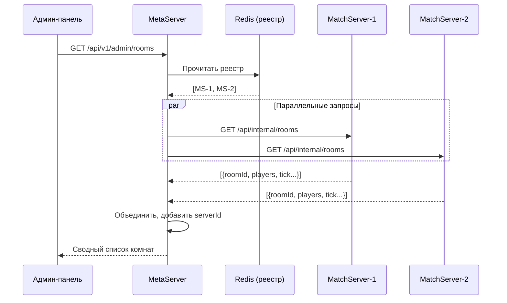

# Slime Arena — ТЗ: Горизонтальное масштабирование MatchServer

## Часть: Core (общая архитектура)

**Версия:** 1.0
**Дата:** 2026-03-02
**Статус:** Draft
**Приоритет:** P1
**Автор:** Claude Opus 4.6

**Связанные части:**

- `TZ-MultiServer-v1.0-Index.md` — приоритеты, критерии приёмки, глоссарий
- `TZ-MultiServer-v1.0-Backend.md` — серверные изменения, API-контракты
- `TZ-MultiServer-v1.0-Client.md` — клиентский роутинг
- `TZ-MultiServer-v1.0-Ops.md` — инфраструктура, деплой

---

## 1. Постановка проблемы

### 1.1. Наблюдаемые симптомы

При нагрузке свыше 20 одновременных комнат (до 20 игроков в каждой) на единственном процессе `MatchServer` наблюдаются:

1. **Деградация игрового цикла.** Тики симуляции превышают бюджет 33 мс (при `simulationIntervalMs = 33.33`). Лаги ощущаются игроками, несмотря на загрузку процессора 50-70%.
2. **Таймауты мониторинга.** Административная панель не может получить данные о комнатах: запрос `GET /api/internal/rooms` к `MatchServer` не успевает за 5-секундный таймаут из-за последовательных `remoteRoomCall()` к каждой комнате.
3. **Некорректные показатели.** Число комнат отображается через раз: один poll-цикл успевает, следующий — нет.
4. **Неконтролируемое создание комнат.** Без обязательной авторизации (`JOIN_TOKEN_REQUIRED` выключен) внешние клиенты создают произвольное число комнат через `joinOrCreate`.

### 1.2. Корневая причина

`MatchServer` — однопоточный процесс Node.js. Все комнаты обрабатываются в едином event loop. При 20+ комнатах с 30 тиками/сек суммарная нагрузка составляет 600+ вызовов `onTick()` в секунду, каждый из которых выполняет 15+ физических и игровых систем. Ядро процессора насыщается, но ОС отображает 50-70% загрузки, поскольку считает по всем ядрам.

### 1.3. Текущее ограничение

`TZ-SoftLaunch-v1.4.7` §1.4 устанавливает: «В софт-лонче допускается один экземпляр серверного приложения». Настоящее ТЗ снимает это ограничение для `MatchServer`, сохраняя единственный экземпляр `MetaServer`.

**Источники:**

- `SlimeArena-Architecture-v4.2.5-Part1.md` §3.1 — компонентная модель
- `SlimeArena-SoftLaunch-Plan-v1.0.5.md` §5.3 — целевые значения: 500 CCU, 60 комнат
- `TZ-SoftLaunch-v1.4.7.md` §1.4 — ограничение single-instance

---

## 2. Целевая архитектура

### 2.1. Обзор

Система переходит от схемы «один MetaServer + один MatchServer» к схеме «один MetaServer + N MatchServer». Каждый `MatchServer` работает как независимый процесс с собственным набором комнат. `MetaServer` координирует маршрутизацию игроков через реестр серверов.

### 2.2. Диаграмма компонентов

### 2.3. Принципы

1. **Независимость MatchServer.** Каждый экземпляр `MatchServer` изолирован. Комнаты одного сервера не взаимодействуют с комнатами другого. `Colyseus RedisPresence`/`RedisDriver` не требуется для базового функционирования (P0).
2. **MetaServer — единая точка координации.** Маршрутизация игроков, создание комнат, сбор метрик — через `MetaServer`.
3. **Прямое подключение клиента.** Клиент подключается напрямую к `MatchServer` по `roomHost:roomPort` из `MatchAssignment`. Промежуточный прокси (Nginx) опционален.
4. **Авторизация создания комнат.** Только `MetaServer` инициирует создание комнат на `MatchServer`. Клиент подключается к уже созданной комнате по `roomId`. Флаг `JOIN_TOKEN_REQUIRED=true` обязателен в production.
5. **Произвольное масштабирование.** Архитектура не ограничивает число `MatchServer`. Верхний предел определяется только ёмкостью `Redis` и пропускной способностью `MetaServer`.
6. **Обратная совместимость.** При единственном зарегистрированном `MatchServer` система ведёт себя идентично текущей.

---

## 3. Реестр MatchServer (`MatchServerRegistry`)

### 3.1. Назначение

Централизованный реестр активных экземпляров `MatchServer`, хранящийся в Redis. Позволяет `MetaServer` выбирать сервер для создания комнаты и мониторить состояние всех серверов.

### 3.2. Жизненный цикл записи

1. **Регистрация.** `MatchServer` при запуске создаёт запись в реестре со статусом `active`.
2. **Heartbeat.** Каждые N секунд `MatchServer` обновляет запись: текущая загрузка, число комнат, число игроков. TTL записи продлевается.
3. **Draining.** Оператор переводит `MatchServer` в статус `draining`. Новые комнаты не создаются. Существующие доигрывают.
4. **Дерегистрация.** При graceful shutdown `MatchServer` удаляет свою запись. При аварийном отключении запись исчезает по TTL.

### 3.3. Схема записи реестра

| Поле | Тип | Описание |
|------|-----|----------|
| `serverId` | строка | Уникальный идентификатор экземпляра |
| `host` | строка | Хост или IP-адрес, доступный клиентам |
| `port` | число | Порт WebSocket |
| `status` | перечисление | `active` / `draining` / `offline` |
| `roomCount` | число | Текущее число активных комнат |
| `playerCount` | число | Текущее число подключённых игроков |
| `maxRooms` | число | Максимально допустимое число комнат (из конфигурации) |
| `registeredAt` | метка времени | Время первой регистрации |
| `lastHeartbeat` | метка времени | Время последнего heartbeat |

### 3.4. Хранение в Redis

- Ключ реестра: `matchserver:registry` (Redis Hash — `serverId` → JSON записи).
- TTL heartbeat: отдельный ключ `matchserver:{serverId}:alive` с TTL = `HEARTBEAT_TIMEOUT_SEC`. Исчезновение ключа означает недоступность сервера.

---

## 4. Алгоритм выбора сервера

### 4.1. Условия выбора

При создании матча `MatchmakingService` выбирает `MatchServer` по следующим критериям (в порядке применения):

1. **Статус `active`.** Серверы в статусе `draining` или `offline` исключаются.
2. **Heartbeat актуален.** Ключ `matchserver:{serverId}:alive` существует в Redis.
3. **Ёмкость не исчерпана.** `roomCount < maxRooms` (значение `maxRooms` из конфигурации сервера).
4. **Наименьшая загрузка.** Из подходящих серверов выбирается тот, у которого наименьшее значение `roomCount`.

### 4.2. Отсутствие подходящего сервера

`REQ-SCALE-003`: Если ни один сервер не удовлетворяет условиям, matchmaking возвращает ошибку «нет доступных серверов» вместо создания комнаты на перегруженном сервере.

### 4.3. Единственный сервер

`REQ-SCALE-005`: При одном зарегистрированном `MatchServer` (типичный случай при migration) алгоритм выбирает его без дополнительной логики. Поведение системы идентично текущему.

---

## 5. Потоки данных

### 5.1. Matchmaking и подключение к матчу

### 5.2. Результаты матча

Поток не изменяется. Каждый `MatchServer` отправляет `MatchSummary` на `MetaServer` через `POST /api/v1/match-results/submit` с `MATCH_SERVER_TOKEN`. Идемпотентность обеспечена `matchId` (UUID).

**Источник:** `SlimeArena-Architecture-v4.2.5-Part1.md` §8.4

### 5.3. Мониторинг (админ-панель)

---

## 6. Безопасность: авторизация создания комнат

### 6.1. Проблема

В текущей реализации клиент использует `joinOrCreate("arena", ...)`. Colyseus автоматически создаёт новую комнату, если все существующие заполнены. Это позволяет внешним скриптам создавать произвольное число комнат, перегружая сервер.

### 6.2. Решение

`REQ-SCALE-100`: В production-окружении флаг `JOIN_TOKEN_REQUIRED` установлен в `true`. Подключение к комнате без валидного `joinToken` отклоняется на этапе `onAuth()`.

`REQ-SCALE-101`: Клиент подключается к комнате по `joinById(roomId, {joinToken})`, а не через `joinOrCreate`. Комната предварительно создана `MetaServer` через internal API `MatchServer`.

`REQ-SCALE-102`: Endpoint `POST /api/internal/create-room` на `MatchServer` защищён `MATCH_SERVER_TOKEN`. Только `MetaServer` может инициировать создание комнаты.

`REQ-SCALE-103`: Colyseus `joinOrCreate` и `create` через публичный WebSocket отключены или ограничены в production-окружении.

---

## 7. Стратегия миграции

### Stage 0 — Текущее состояние

Один `MetaServer` + один `MatchServer`. Env-переменные `MATCH_SERVER_HOST`/`PORT`. Клиент использует `joinOrCreate`.

### Stage 1 — Инфраструктура (P0)

- Добавить `MatchServerRegistry` в Redis.
- `MatchServer` регистрируется при старте, отправляет heartbeat.
- `MatchmakingService` выбирает сервер из реестра (при единственном сервере — поведение идентично текущему).
- Новый endpoint `POST /api/internal/create-room` на `MatchServer`.
- Клиент использует `roomHost`/`roomPort` из `MatchAssignment` и `joinById`.
- `JOIN_TOKEN_REQUIRED=true` в production.

На этом этапе в production по-прежнему один `MatchServer`, но архитектура готова к масштабированию.

### Stage 2 — Второй MatchServer (P0)

- Добавить второй контейнер `MatchServer` (Docker Compose или отдельная VPS).
- Проверить: матчи распределяются между серверами; результаты матчей доставляются; клиент подключается к правильному серверу.

### Stage 3 — Операционная зрелость (P1)

- Admin panel отображает данные со всех серверов.
- Health check и drain API.
- Автоматическое удаление недоступных серверов из реестра.
- Документированные сценарии rolling update и масштабирования.

---

## 8. Конфигурация

### 8.1. Новые переменные окружения для MatchServer

| Переменная | Умолчание | Описание |
|------------|-----------|----------|
| `MATCH_SERVER_ID` | Автогенерация UUID | Уникальный идентификатор экземпляра |
| `MATCH_SERVER_PUBLIC_HOST` | значение `HOST` | Хост, видимый клиентам (может отличаться от bind-адреса) |
| `MATCH_SERVER_PUBLIC_PORT` | значение `PORT` | Порт, видимый клиентам |
| `MAX_ROOMS_PER_SERVER` | 30 | Максимальное число одновременных комнат |
| `HEARTBEAT_INTERVAL_SEC` | 10 | Интервал отправки heartbeat в Redis |
| `HEARTBEAT_TIMEOUT_SEC` | 30 | TTL записи alive в Redis |

### 8.2. Изменения в MetaServer

| Переменная | Статус | Описание |
|------------|--------|----------|
| `MATCH_SERVER_HOST` | Устаревает (Stage 1+) | Заменяется на реестр. Используется как fallback при пустом реестре |
| `MATCH_SERVER_PORT` | Устаревает (Stage 1+) | Аналогично |
| `MATCH_SERVER_TOKEN` | Без изменений | Общий токен для server-to-server авторизации |

---

## 9. Открытые вопросы

1. **Colyseus RedisPresence/RedisDriver.** Для P0 каждый `MatchServer` работает независимо. Если в будущем потребуется перемещение игроков между серверами или глобальный matchMaker Colyseus, потребуется RedisPresence. Решение отложено до выявления потребности.

2. **MATCH_SERVER_TOKEN.** Текущее ТЗ предполагает один общий токен для всех MatchServer. Индивидуальные токены повышают безопасность, но усложняют ротацию. Решение: один общий токен для P0, пересмотр при необходимости.

3. **Уведомление игроков при аварии.** При аварийном отключении `MatchServer` игроки теряют текущий матч. Механизм push-уведомления через `MetaServer` (например, «сервер недоступен, попробуйте снова») не входит в P0, но может быть добавлен как P2.

4. **TLS для прямых подключений.** При прямом подключении клиента к `MatchServer` через `wss://` каждому серверу нужен TLS-сертификат. Варианты: wildcard-сертификат для поддомена (например, `ms1.slime-arena.overmobile.space`), Let's Encrypt per server, или TLS-терминация на Nginx перед каждым MatchServer. Решение зависит от выбранной топологии (§7 TZ-MultiServer-v1.0-Ops.md).
