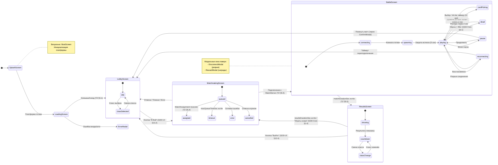

# Slime Arena — Карта экранов и навигации

**Версия:** 1.6.1  
**Дата:** 9 января 2026  
**Статус:** Согласовано  
**Источники:** GDD-UI.md (v3.3), GDD-Core.md (v3.3), TZ-SoftLaunch-v1.4.7.md, SlimeArena-Architecture-v4.2.5-Part4.md, SlimeArena-UI-TZ-v1.6.1.md  

---

## Резюме изменений v1.6.1

Патч по результатам ревью DeepSeek:

1. **«Ещё раз» → «Играть снова»:** унифицировано название кнопки во всех схемах.
2. **TR-006:** уточнён с автоматическим ретраем (до 3 попыток), добавлен источник.
3. **TR-005, TR-023:** добавлены источники (Архитектура §5.3).
4. **Связанные документы:** обновлена ссылка на UI-TZ v1.6.1.

---

## Резюме изменений v1.6

Финальные правки по результатам ревью DeepSeek:

1. **Consent/DataDeletion:** явно зафиксировано отображение в `SettingsScreen` (§8.6).
2. **Синхронизация с UI-TZ v1.6:** добавлена ссылка на UI-TZ как источник.

---

## Резюме изменений v1.5

Документ синхронизирован с UI-TZ v1.5. Устранены все P0-противоречия, выявленные при ревью:

1. **Боевой цикл унифицирован:** `ResultsScreen` → `MatchmakingScreen` → `BattleScreen`.
2. **Смена класса на результатах:** [MUST] разрешена для следующего матча.
3. **`paymentsEnabled=false`:** [MUST] показывает `PlatformLimitModal`, не `ErrorModal`.
4. **Удаление данных:** [MUST] через `InfoModal` с инструкцией, убрано из `ConfirmModal`.
5. **Кнопка «Играть снова»:** [MUST] присутствует на `ResultsScreen`.
6. **Boot-флоу:** добавлен маппинг на визуальный `BootScreen`.

---

## 1. Назначение и принципы навигации

### 1.1. Назначение документа

Документ определяет полный перечень экранов игры, их иерархию, правила переходов и состояния. Служит основой для проектирования навигации и реализации **ScreenManager** (см. [Глоссарий](#глоссарий)).

### 1.2. Принципы навигации

1. **Единый стек**: навигация строится на `ScreenManager` — стек экранов и стек модальных окон с единой обработкой кнопки «назад».
2. **Разделение потоков**: **мэйнфлоу** (боевой цикл) отделён от **мета-экранов** (профиль, магазин, пропуск).
3. **Центральный узел**: `LobbyScreen` — точка входа во все потоки, не удаляется из стека.
4. **Идемпотентность**: операции с ценностью (покупки, награды) защищены **operationId** — повторный запрос не дублирует действие.
5. **Серверный авторитет**: содержимое экранов определяется **RuntimeConfig** и может меняться без релиза клиента.

Источник: Архитектура §5.2, §6, §7; TZ §4; План §3.

### 1.3. Правила для WebView и iframe

| Правило | Описание | Источник |
|---------|----------|----------|
| Безопасные отступы | UI не перекрывается системными панелями (верх/низ) | Архитектура §7 |
| Запрет прокрутки | Страница не прокручивается при управлении | Архитектура §7 |
| Реакция на клавиатуру | UI адаптируется при появлении виртуальной клавиатуры | Архитектура §7 |
| Кнопка «Назад» | Управляется `ScreenManager`, не закрывает приложение неконтролируемо | Архитектура §7 |
| Запрет выделения | Текст не выделяется при управлении | Архитектура §7 |

### 1.4. Модель матчей: дискретные комнаты

**Архитектурное решение:**

GDD-Core §1.4 описывает **игровую логику** цикла матчей. Клиентская навигация реализует **дискретную модель**: каждый матч — отдельная комната Colyseus.

**Боевой цикл после завершения матча:**

1. [MUST] Клиент показывает `ResultsScreen` (получает **MatchSummary**).
2. [MUST] По истечении `resultsDurationSec` **или** по нажатию «Играть снова» автоматически вызывается `matchmaking/join`.
3. [MUST] Клиент переходит на `MatchmakingScreen`, получает **MatchAssignment**.
4. [MUST] Клиент подключается к новой комнате, переход на `BattleScreen`.

Это соответствует архитектуре с `MetaServer` и `MatchmakingService` (TZ §5.4, Архитектура §3.3).

**Следствие:** TR-052 ведёт в `MatchmakingScreen`, а не напрямую в `BattleScreen`.

---

## 2. Классификация экранов

### 2.1. Системные экраны

Экраны инициализации и загрузки приложения.

| Идентификатор | Название | Приоритет | Визуальный макет | Роль |
|---------------|----------|-----------|------------------|------|
| `SplashScreen` | Заставка | P0 | `BootScreen` | Первый экран, инициализация платформы |
| `LoadingScreen` | Загрузка | P0 | `BootScreen` | Авторизация, загрузка `RuntimeConfig` |

**Примечание:** Оба экрана визуально реализуются на базе единого макета `BootScreen` из UI-TZ. Логически это два состояния одного визуального экрана.

### 2.2. Экраны мэйнфлоу (боевой цикл)

Основной игровой цикл: Лобби → Матчмейкинг → Матч → Результаты.

| Идентификатор | Название | Приоритет | Источник | Роль |
|---------------|----------|-----------|----------|------|
| `LobbyScreen` | Лобби | P0 | GDD-UI §13 | Центральный узел, выбор класса |
| `MatchmakingScreen` | Поиск матча | P0 | TZ §5.4 | Очередь, назначение матча |
| `BattleScreen` | Матч | P0 | GDD-UI §1 | Игровой процесс и HUD |
| `ResultsScreen` | Результаты | P0 | GDD-UI §12 | Итоги матча, награды, выбор класса для следующего матча |

### 2.3. Мета-экраны

Доступны из `LobbyScreen` через навигационную панель.

| Идентификатор | Название | Приоритет | Источник | Роль |
|---------------|----------|-----------|----------|------|
| `ProfileScreen` | Профиль | P0 | TZ §5.3 | Статистика, инвентарь, ник |
| `ShopScreen` | Магазин | P1 | TZ §5.7 | Витрины, покупки |
| `SettingsScreen` | Настройки | P1 | Архитектура §6 | Звук, язык, удаление данных |
| `BattlePassScreen` | Боевой пропуск | P2 `[MAY]` | TZ §5.9 | Сезонные награды |
| `LeaderboardScreen` | Рейтинги | P2 `[MAY]` | TZ §5.10 | Таблицы лидеров |
| `AchievementsScreen` | Достижения | P2 `[MAY]` | TZ §5.9 | Список и прогресс |

**Примечание:** Экраны с приоритетом P2 `[MAY]` не входят в обязательный состав софт-лонча. Их видимость управляется через `features.json` (Архитектура A.9). При `featureFlag.battlepass=false` соответствующие кнопки [MUST] скрываются из навигационной панели.

### 2.4. Модальные окна

Отображаются поверх текущего экрана, блокируют взаимодействие с ним.

| Идентификатор | Название | Контекст появления | Источник |
|---------------|----------|-------------------|----------|
| `RewardModal` | Награда | Сундук, пропуск, достижение, реклама | TZ §5.8 |
| `ConfirmModal` | Подтверждение | Покупка, выход из матча | Архитектура §6 |
| `ErrorModal` | Ошибка | Сетевые ошибки, недостаток валюты, ошибки сервера | TZ §5.7 |
| `DisconnectModal` | Потеря соединения | Разрыв WebSocket с `MatchServer` | Архитектура §5.3.1 |
| `PlatformLimitModal` | Ограничение платформы | Функция недоступна (`paymentsEnabled=false`, `adsRewardEnabled=false`) | Архитектура §2.2 |
| `ClassSelectModal` | Выбор класса | Детальный просмотр класса в лобби | GDD-UI §13 |
| `InfoModal` | Информация | Инструкция по удалению данных | Архитектура §F.5 |

**Примечание:** `InfoModal` — модальное окно с текстом и кнопкой закрытия. Используется для отображения инструкций без выполнения серверных операций.

### 2.5. Внутриматчевые оверлеи

Отображаются поверх `BattleScreen`, не останавливают симуляцию.

| Идентификатор | Название | Описание | Источник |
|---------------|----------|----------|----------|
| `CardPickerOverlay` | Карточки выбора | Выбор талантов и умений (1 из 3) | GDD-UI §6, GDD-Talents §7 |
| `PauseOverlay` | Меню паузы | Выход из матча, настройки звука | GDD-UI §1 |
| `DeathOverlay` | Гибель | Таймер респауна (2 сек), статистика | GDD-Core §3.1 |
| `FinalCountdownOverlay` | Финальный отсчёт | Последние 10 секунд матча | GDD-Core §1.3 |

---

## 3. Константы таймаутов

Единое место хранения временных параметров, используемых в навигации и переходах.

| Константа | Значение | Единица | Описание | Источник |
|-----------|----------|---------|----------|----------|
| `MATCH_DURATION` | 180 | сек | Длительность матча | GDD-Core §1.2 |
| `RESPAWN_TIME` | 2 | сек | Время респауна после гибели | GDD-Core §3.1 |
| `SPAWN_PROTECTION` | 5 | сек | Защита при появлении | GDD-Core §1.3 |
| `RESULTS_DURATION` | 12 | сек | Длительность экрана результатов | GDD-Core §1.4 |
| `CARD_AUTOPICK` | 12 | сек | Таймер автовыбора карточки | GDD-Talents §7.4 |
| `FINAL_COUNTDOWN` | 10 | сек | Длительность финального отсчёта | GDD-Core §1.3 |
| `RECONNECT_WINDOW` | 15000 | мс | Окно переподключения | Архитектура §5.3.1 |
| `MAX_QUEUE_TIME` | 180 | сек | Максимальное время в очереди | Архитектура A.8 |
| `DEATH_OVERLAY_AUTO` | 2 | сек | Автопереход из `DeathOverlay` | GDD-Core §3.1 |
| `authTimeoutMs` | 15000 | мс | Таймаут авторизации (дефолт клиента) | resilience.json |
| `configLoadTimeoutMs` | 10000 | мс | Таймаут загрузки `RuntimeConfig` (дефолт клиента) | resilience.json |
| `bootTotalTimeoutMs` | 30000 | мс | Суммарный таймаут загрузки (дефолт клиента) | resilience.json |
| `bootMaxRetries` | 3 | — | Макс. автоматических ретраев (дефолт клиента) | resilience.json |

**Примечание:** Константы boot-флоу являются дефолтами клиента до получения `RuntimeConfig`. После загрузки конфигурации используются значения из `resilience.json`. Если `resilience.json` не содержит этих полей, применяются дефолты.

---

## 4. Глобальная слоистость (Z-Index)

Правила отображения элементов при наложении. Элементы с большим приоритетом перекрывают элементы с меньшим.

| Приоритет | Слой | Содержимое | Примечание |
|-----------|------|------------|------------|
| 100 | Критические модалки | `ErrorModal`, `DisconnectModal` | Перекрывают всё приложение |
| 90 | Системные модалки | `ConfirmModal`, `PlatformLimitModal`, `InfoModal` | Блокируют взаимодействие |
| 80 | Награды | `RewardModal` | Поверх контента |
| 70 | Внутриматчевые оверлеи | `PauseOverlay`, `DeathOverlay`, `CardPickerOverlay` | См. раздел 9.2 |
| 60 | HUD матча | Элементы интерфейса боя | Не управляется `ScreenManager` |
| 50 | Canvas боя | `BattleContainer`, `RenderSystem` | Игровой мир |
| 40 | Экраны `ScreenManager` | `LobbyScreen`, `ShopScreen` и др. | Основной контент |
| 10 | Фон | Статичный фон приложения | — |

**Правило:** Глобальные модальные окна (`ErrorModal`, `DisconnectModal`) [MUST] всегда перекрывают `BattleContainer` и Canvas, чтобы критические сообщения были видны в любом состоянии.

---

## 5. Диаграммы потоков

### 5.1. Обзорная схема (блок-схема)

```
┌─────────────────────────────────────────────────────────────────────────────┐
│                              ИНИЦИАЛИЗАЦИЯ                                   │
│          SplashScreen → LoadingScreen → Авторизация → RuntimeConfig         │
│                    (визуально: единый BootScreen)                            │
└─────────────────────────────────────┬───────────────────────────────────────┘
                                      │
                                      ▼
┌─────────────────────────────────────────────────────────────────────────────┐
│                                 МЕТА-ИГРА                                    │
│  ┌─────────────────────────────────────────────────────────────────────┐    │
│  │                             ЛОББИ                                    │    │
│  │                    (центральный узел навигации)                      │    │
│  └───┬─────┬─────┬─────┬─────┬─────┬─────────────────────────────────┬──┘    │
│      │     │     │     │     │     │                                 │       │
│      ▼     ▼     ▼     ▼     ▼     ▼                                 │       │
│  Профиль Магазин Пропуск Рейтинги Достижения Настройки               │       │
│                                                                       │       │
└───────────────────────────────────────────────────────────────────────┼──────┘
                                                                        │
                                                                        │ "В бой"
                                                                        ▼
┌─────────────────────────────────────────────────────────────────────────────┐
│                              БОЕВОЙ ЦИКЛ                                     │
│                                                                              │
│  ┌───────────────┐      ┌───────────────┐      ┌───────────────┐            │
│  │  МАТЧМЕЙКИНГ  │ ───► │     МАТЧ      │ ───► │  РЕЗУЛЬТАТЫ   │            │
│  │               │      │               │      │               │            │
│  │  • queued     │      │  • playing    │      │  • showing    │            │
│  │  • assigned   │      │  • dead       │      │  • countdown  │            │
│  │  • timeout    │      │  • cardPicking│      │               │            │
│  │  • error      │      │  • reconnect  │      │  Выбор класса │            │
│  └───────┬───────┘      └───────────────┘      └──┬─────────┬──┘            │
│          │                                        │         │               │
│          │ отмена                        "Выйти"  │         │ авто/ещё раз  │
│          │                                        │         │               │
│          ▼                                        │         └───────────────┤
│       ЛОББИ ◄─────────────────────────────────────┘                         │
│          ▲                                                                   │
│          └────────────── МАТЧМЕЙКИНГ ◄──────────────────────────────────────┘
│                                                                              │
└──────────────────────────────────────────────────────────────────────────────┘
```

### 5.2. Детальная диаграмма состояний (Mermaid)



---

## 6. Схема навигации (ASCII)

### 6.1. Общая структура

```
┌─────────────────────────────────────────────────────────────────────────┐
│                         ЗАПУСК ПРИЛОЖЕНИЯ                                │
│                    (PlatformManager.initialize)                          │
└─────────────────────────────┬───────────────────────────────────────────┘
                              │
                              ▼
                    ┌──────────────────┐
                    │   SplashScreen   │
                    │  (→ BootScreen)  │
                    └────────┬─────────┘
                             │
                             ▼
                    ┌──────────────────┐
                    │  LoadingScreen   │
                    │  (→ BootScreen)  │
                    └────────┬─────────┘
                             │
              ┌──────────────┼──────────────┐
              │ Успех        │              │ Ошибка
              ▼              │              ▼
┌────────────────────────────┴────────────────────────────────────────────┐
│                              ЛОББИ                                       │
│  ┌─────────────────────────────────────────────────────────────────┐    │
│  │                    Навигационная панель                          │    │
│  │  [Профиль] [Магазин] [Пропуск] [Рейтинги] [Достижения] [Настр.] │    │
│  └─────────────────────────────────────────────────────────────────┘    │
│                                                                          │
│  ┌─────────────────────────────────────────────────────────────────┐    │
│  │                      Выбор класса                                │    │
│  │         [Охотник]    [Воин]    [Собиратель]                     │    │
│  └─────────────────────────────────────────────────────────────────┘    │
│                                                                          │
│                         [КНОПКА: В БОЙ]                                  │
└──────────────────────────────┬──────────────────────────────────────────┘
                               │
                               ▼
                    ┌──────────────────┐
                    │   МАТЧМЕЙКИНГ    │
                    │                  │
                    │  Состояние:      │
                    │  • queued        │
                    │  • assigned      │
                    │  • cancelled     │
                    │  • timeout       │
                    │  • error         │
                    └────────┬─────────┘
                             │
              ┌──────────────┼──────────────┐
              │ assigned     │              │ cancelled/timeout/error
              ▼              │              ▼
┌─────────────────────────────┐           ┌─────────────┐
│           МАТЧ              │           │    Лобби    │
│  ┌───────────────────────┐  │           └─────────────┘
│  │        HUD            │  │
│  │  • Масса/Уровень      │  │
│  │  • Мини-карта         │  │
│  │  • Умения             │  │
│  │  • Джойстик           │  │
│  │  • Таймер             │  │
│  │  • Очередь выборов    │  │
│  └───────────────────────┘  │
│                             │
│  Оверлеи:                   │
│  • CardPickerOverlay        │
│  • DeathOverlay             │
│  • PauseOverlay             │
│  • FinalCountdownOverlay    │
└──────────────┬──────────────┘
               │
               │ matchDurationSec истёк (180 сек)
               ▼
    ┌──────────────────────┐
    │      РЕЗУЛЬТАТЫ      │
    │                      │
    │  • Таблица (топ-10)  │
    │  • Личная статистика │
    │  • Выбор класса      │◄── Для следующего матча
    │  • Таймер 12 сек     │
    │                      │
    │  [Выйти] [Играть снова]│
    └──────────┬───────────┘
               │
    ┌──────────┴──────────┐
    │                     │
    ▼                     ▼
  Лобби              Матчмейкинг ─────► Матч
(по кнопке)        (авто / кнопка)
```

**Примечание:** По истечении `resultsDurationSec` (12 сек) или по кнопке «Играть снова» происходит переход к `MatchmakingScreen` с вызовом `matchmaking/join` (GDD-Core §1.4, Архитектура §3.3).

---

## 7. Таблицы переходов

### 7.1. Переходы из `SplashScreen` и `LoadingScreen`

| ID | Действие | Целевой экран | Условие | Время | Триггер | Источник |
|----|----------|---------------|---------|-------|---------|----------|
| TR-001 | Платформа инициализирована | `LoadingScreen` | — | — | `platform_ready` | Архитектура §5.1 |
| TR-002 | Авторизация успешна | `LobbyScreen` | `RuntimeConfig` загружен | — | `auth_success` | TZ §5.1 |
| TR-003 | Ошибка авторизации | `ErrorModal` | — | — | `auth_error` | TZ §5.1 |
| TR-004 | Сетевая ошибка | `ErrorModal` | — | — | `network_error` | Архитектура §5.3 |
| TR-005 | Повторить авторизацию | `LoadingScreen` | Из `ErrorModal` | — | `retry` | Архитектура §5.3 |
| TR-006 | Таймаут загрузки | Автоматический ретрай (до 3), затем `ErrorModal` | 30 сек без ответа | 30 сек × попытка | `loading_timeout` | Архитектура §5.3, TZ §A |

**Правила ретрая (boot-флоу):**

| Ошибка | Поведение | Макс. попыток |
|--------|-----------|---------------|
| Сетевая ошибка | `ErrorModal` с кнопкой «Повторить» | Не ограничено |
| Ошибка авторизации | `ErrorModal` с описанием, кнопка «Повторить» | Не ограничено |
| Таймаут загрузки | Автоматический ретрай (3 раза), затем `ErrorModal` | 3 |
| Недоступность платформы | `ErrorModal` без ретрая, кнопка «Выйти» | — |

### 7.2. Переходы из `LobbyScreen`

| ID | Действие | Целевой экран | Условие | Время | Триггер | Источник |
|----|----------|---------------|---------|-------|---------|----------|
| TR-010 | Нажать «В бой» | `MatchmakingScreen` | Класс выбран | — | `matchmaking_join` | TZ §5.4 |
| TR-011 | Нажать иконку профиля | `ProfileScreen` | — | — | `screen_open` | TZ §5.3 |
| TR-012 | Нажать иконку магазина | `ShopScreen` | — | — | `screen_open` | TZ §5.7 |
| TR-013 | Нажать иконку пропуска | `BattlePassScreen` | `features.battlepass=true` | — | `screen_open` | TZ §5.9 |
| TR-014 | Нажать иконку рейтингов | `LeaderboardScreen` | `features.leaderboard=true` | — | `screen_open` | TZ §5.10 |
| TR-015 | Нажать иконку достижений | `AchievementsScreen` | `features.achievements=true` | — | `screen_open` | TZ §5.9 |
| TR-016 | Нажать иконку настроек | `SettingsScreen` | — | — | `screen_open` | Архитектура §6 |
| TR-017 | Нажать на карточку класса | `ClassSelectModal` | — | — | — | GDD-UI §13.2 |

### 7.3. Переходы из `MatchmakingScreen`

| ID | Действие | Целевой экран | Условие | Время | Триггер | Источник |
|----|----------|---------------|---------|-------|---------|----------|
| TR-020 | Получен `MatchAssignment` | `BattleScreen` | `state = assigned` | — | `matchmaking_assigned` | TZ §5.4 |
| TR-021 | Нажать «Отмена» | `LobbyScreen` | — | — | `matchmaking_cancel` | TZ §5.4 |
| TR-022 | Истёк `maxQueueTimeSec` | `LobbyScreen` | — | 180 сек | `matchmaking_timeout` | Архитектура A.8 |
| TR-023 | Сетевая ошибка | `ErrorModal` → `LobbyScreen` | — | — | `error` | Архитектура §5.3 |

### 7.4. Переходы из `BattleScreen`

| ID | Действие | Целевой экран | Условие | Время | Триггер | Источник |
|----|----------|---------------|---------|-------|---------|----------|
| TR-030 | Истёк `matchDurationSec` | `ResultsScreen` | — | 180 сек | `match_end` | TZ §5.5 |
| TR-031 | Нажать «Выйти» в `PauseOverlay` | `ConfirmModal` | — | — | — | — |
| TR-032 | Подтвердить выход | `LobbyScreen` | — | — | `match_leave` | — |
| TR-033 | Потеря соединения | `DisconnectModal` | — | — | `disconnect` | Архитектура §5.3.1 |
| TR-034 | Переподключение успешно | `BattleScreen` | В пределах 15 сек | — | `reconnect_success` | Plan §5.3 |
| TR-035 | Переподключение неуспешно | `LobbyScreen` | Истёк `reconnectWindowMs` | 15 сек | `reconnect_fail` | Plan §5.3 |
| TR-036 | Уровень 3 или 5 | `CardPickerOverlay` | Открыт слот умения | — | — | GDD-Core §5.2 |
| TR-037 | Достигнут порог массы | `CardPickerOverlay` | Выбор таланта | — | — | GDD-Talents §7.2 |
| TR-038 | Масса < 50 кг | `DeathOverlay` | Гибель | — | — | GDD-Core §3.1 |
| TR-039 | Респаун | Закрытие `DeathOverlay` | — | 2 сек | — | GDD-Core §3.1 |
| TR-040 | Финальные 10 секунд | `FinalCountdownOverlay` | — | — | — | GDD-Core §1.3 |

### 7.5. Переходы из `ResultsScreen`

| ID | Действие | Целевой экран | Условие | Время | Триггер | Источник |
|----|----------|---------------|---------|-------|---------|----------|
| TR-050 | Нажать «Выйти» | `LobbyScreen` | — | — | `results_exit` | GDD-UI §12.4 |
| TR-051 | Нажать «Играть снова» | `MatchmakingScreen` | — | — | `results_replay` | GDD-UI §12.4 |
| TR-052 | Истёк `resultsDurationSec` | `MatchmakingScreen` | Автостарт нового матча | 12 сек | `results_autostart` | GDD-Core §1.4 |
| TR-053 | Выбор класса | — (на том же экране) | Для следующего матча | — | `class_select` | GDD-UI §12.4 |

**Примечание к TR-051, TR-052 и TR-053:**

1. **Кнопка «Играть снова»** [MUST] присутствует на экране результатов для ручного запуска следующего матча.
2. **Автопереход** происходит по истечении `resultsDurationSec` (12 сек) с вызовом `matchmaking/join`.
3. **Смена класса** на `ResultsScreen` [MUST] применяется к следующему матчу. Текущий матч уже завершён.

**Разрешение противоречия GDD-Core §1.1 vs GDD-UI §12.4:**

- GDD-Core §1.1 говорит о фиксации `classId` **на текущий матч** — класс нельзя сменить во время матча.
- GDD-UI §12.4 описывает выбор класса **для следующего матча** — текущий матч уже завершён.
- `ResultsScreen` функционально является «мини-лобби» перед новым матчмейкингом.

### 7.6. Переходы из `ShopScreen`

| ID | Действие | Целевой экран | Условие | Время | Триггер | Источник |
|----|----------|---------------|---------|-------|---------|----------|
| TR-060 | Кнопка «Назад» | `LobbyScreen` | — | — | — | — |
| TR-061 | Покупка успешна | `RewardModal` | `operationId` уникален | — | `purchase` | TZ §5.7 |
| TR-062 | Недостаточно валюты | `ErrorModal` | — | — | `purchase_failed` | TZ §5.7 |
| TR-063 | Просмотр рекламы завершён | `RewardModal` | `grantId` валиден | — | `ad_reward` | TZ §5.8 |
| TR-064 | Платежи выключены | `PlatformLimitModal` | `paymentsEnabled=false` | — | `payments_disabled` | Plan §5.4 |

**Примечание к TR-064:** При `paymentsEnabled=false` [MUST] показывается `PlatformLimitModal`, а не `ErrorModal`. Это не ошибка, а ограничение платформы.

### 7.7. Переходы из мета-экранов

| ID | Экран | Действие | Целевой экран | Время | Триггер |
|----|-------|----------|---------------|-------|---------|
| TR-070 | `ProfileScreen` | Кнопка «Назад» | `LobbyScreen` | — | — |
| TR-071 | `SettingsScreen` | Кнопка «Назад» | `LobbyScreen` | — | — |
| TR-072 | `SettingsScreen` | Запрос удаления данных | `InfoModal` с инструкцией | — | — |
| TR-073 | `BattlePassScreen` | Кнопка «Назад» | `LobbyScreen` | — | — |
| TR-074 | `BattlePassScreen` | Получение награды | `RewardModal` | — | `battlepass_claim` |
| TR-075 | `LeaderboardScreen` | Кнопка «Назад» | `LobbyScreen` | — | — |
| TR-076 | `AchievementsScreen` | Кнопка «Назад» | `LobbyScreen` | — | — |
| TR-077 | `AchievementsScreen` | Получение награды | `RewardModal` | — | `achievement_claim` |

**Примечание к TR-072:** Удаление данных [MUST] инициируется через поддержку/платформу (Архитектура §F.5). Кнопка «Удалить данные» открывает `InfoModal` с инструкцией и контактом поддержки. Серверная операция удаления не вызывается из клиента.

---

## 8. Состояния экранов

### 8.1. Системные экраны

#### `SplashScreen`

| Состояние | Описание | Доступные действия |
|-----------|----------|-------------------|
| `initializing` | Инициализация `PlatformManager` | Нет |
| `ready` | Платформа готова | Автопереход к `LoadingScreen` |

#### `LoadingScreen`

| Состояние | Описание | Доступные действия |
|-----------|----------|-------------------|
| `authenticating` | Авторизация через `IAuthProvider` | Нет |
| `loadingConfig` | Загрузка `RuntimeConfig` | Нет |
| `ready` | Данные загружены | Автопереход к `LobbyScreen` |
| `retrying` | Автоматический ретрай (1-3 попытка) | Нет |
| `error` | Ошибка загрузки после всех попыток | Повторить (из `ErrorModal`) |

**Визуальное представление:** Оба экрана используют макет `BootScreen` с различными текстами статуса.

**Таймауты:**

| Этап | Таймаут | Действие при таймауте |
|------|---------|----------------------|
| Авторизация | 15 сек | Переход в `retrying` |
| Загрузка `RuntimeConfig` | 10 сек | Переход в `retrying` |
| Суммарный таймаут | 30 сек | Переход в `error` |

### 8.2. Экраны мэйнфлоу

#### `LobbyScreen`

| Состояние | Описание | Доступные действия |
|-----------|----------|-------------------|
| `loading` | Загрузка данных профиля и `RuntimeConfig` | Нет |
| `idle` | Ожидание действия игрока, класс не выбран | Навигация, выбор класса |
| `classSelected` | Класс выбран, готов к бою | Кнопка «В бой» активна, навигация |

#### `MatchmakingScreen`

| Состояние | Описание | Доступные действия |
|-----------|----------|-------------------|
| `queued` | В очереди, ожидание `MatchAssignment` | Отмена |
| `assigned` | Матч назначен, подключение к `MatchServer` | Нет (автопереход) |
| `cancelled` | Отменено игроком | Нет (возврат в лобби) |
| `timeout` | `maxQueueTimeSec` истёк | Нет (возврат в лобби) |
| `error` | Сетевая ошибка | Нет (переход к `ErrorModal`) |

#### `BattleScreen`

| Состояние | Описание | Доступные действия |
|-----------|----------|-------------------|
| `connecting` | Подключение к комнате Colyseus | Нет |
| `spawning` | Защита при появлении (5 сек) | Движение, сбор пузырей |
| `playing` | Активная игра | Все действия |
| `dead` | Гибель, ожидание респауна (2 сек) | Просмотр карты |
| `cardPicking` | Выбор карточки активен | Выбор карточки, движение |
| `pause` | Меню паузы открыто | Продолжить, выйти |
| `reconnecting` | Переподключение в пределах `reconnectWindowMs` | Нет |
| `finished` | `matchDurationSec` истёк | Нет (автопереход) |

#### `ResultsScreen`

| Состояние | Описание | Доступные действия |
|-----------|----------|-------------------|
| `showing` | Отображение результатов | Выход |
| `countdown` | Обратный отсчёт `resultsDurationSec` | Смена класса, выход, играть снова |

**Примечание:** По истечении `resultsDurationSec` или по нажатию «Играть снова» происходит переход к `MatchmakingScreen` с выбранным классом (GDD-Core §1.4).

### 8.3. Мета-экраны

#### `ProfileScreen`

| Состояние | Описание | Доступные действия |
|-----------|----------|-------------------|
| `loading` | Загрузка данных профиля | Нет |
| `ready` | Данные отображены | Навигация, изменение ника |
| `error` | Ошибка загрузки | Повторить, назад |

#### `ShopScreen`

| Состояние | Описание | Доступные действия |
|-----------|----------|-------------------|
| `loading` | Загрузка каталога | Нет |
| `ready` | Каталог отображён | Покупка, просмотр, назад |
| `purchasing` | Обработка покупки | Нет |
| `error` | Ошибка загрузки | Повторить, назад |

#### `SettingsScreen`

| Состояние | Описание | Доступные действия |
|-----------|----------|-------------------|
| `ready` | Настройки отображены | Изменение звука/языка, запрос удаления данных, назад |

**Примечание:** 
- **Согласия (`Consent`):** отображаются в режиме «только чтение». Состояния согласий хранятся на сервере и отдаются в профиле (Архитектура §F.4). Изменение согласий через UI не предусмотрено.
- **Удаление данных (`DataDeletion`):** инициируется через поддержку/платформу согласно Архитектуре §F.5. Кнопка «Удалить данные» [MUST] открывать `InfoModal` с инструкцией и контактом поддержки.

#### `BattlePassScreen`

| Состояние | Описание | Доступные действия |
|-----------|----------|-------------------|
| `loading` | Загрузка прогресса | Нет |
| `ready` | Прогресс отображён | Получение награды, назад |
| `claiming` | Получение награды | Нет |
| `error` | Ошибка загрузки | Повторить, назад |

#### `LeaderboardScreen`

| Состояние | Описание | Доступные действия |
|-----------|----------|-------------------|
| `loading` | Загрузка рейтинга | Нет |
| `ready` | Рейтинг отображён | Навигация по страницам, назад |
| `error` | Ошибка загрузки | Повторить, назад |

#### `AchievementsScreen`

| Состояние | Описание | Доступные действия |
|-----------|----------|-------------------|
| `loading` | Загрузка достижений | Нет |
| `ready` | Достижения отображены | Получение награды, назад |
| `claiming` | Получение награды | Нет |
| `error` | Ошибка загрузки | Повторить, назад |

---

## 9. Матрица совместимости оверлеев и состояний

### 9.1. Разрешённые комбинации в `BattleScreen`

Какие оверлеи могут отображаться в каком состоянии.

| Состояние | `CardPickerOverlay` | `DeathOverlay` | `PauseOverlay` | `FinalCountdownOverlay` | `DisconnectModal` |
|-----------|:-------------------:|:--------------:|:--------------:|:-----------------------:|:-----------------:|
| `connecting` | — | — | — | — | ✓ |
| `spawning` | — | — | ✓ | — | ✓ |
| `playing` | ✓ | — | ✓ | ✓ | ✓ |
| `dead` | — | ✓ | — | ✓ | ✓ |
| `cardPicking` | ✓ | — | — | ✓ | ✓ |
| `pause` | — | — | ✓ | — | ✓ |
| `reconnecting` | — | — | — | — | ✓ |
| `finished` | — | — | — | — | ✓ |

**Легенда:** ✓ — разрешено, — — запрещено

### 9.2. Приоритет оверлеев в матче

При одновременном появлении нескольких оверлеев отображается оверлей с наивысшим приоритетом.

| Приоритет | Оверлей | Поведение | Блокирует ввод |
|-----------|---------|-----------|----------------|
| 1 (высший) | `DisconnectModal` | Показывает таймер переподключения | Да |
| 2 | `PauseOverlay` | Блокирует ввод, не останавливает симуляцию | Да |
| 3 | `DeathOverlay` | Показывается при гибели, таймер 2 сек | Частично |
| 4 | `CardPickerOverlay` | Сворачивается при получении урона | Нет |
| 5 (низший) | `FinalCountdownOverlay` | Не блокирует ввод | Нет |

### 9.3. Правила взаимодействия

1. `DisconnectModal` перекрывает все остальные оверлеи и блокирует любые действия.
2. `CardPickerOverlay` автоматически сворачивается при получении урона (переход в состояние `dead`).
3. `DeathOverlay` закрывается автоматически через 2 сек с переходом в `playing`.
4. `FinalCountdownOverlay` отображается поверх `CardPickerOverlay`, но не прерывает выбор карточки.
5. `PauseOverlay` нельзя открыть в состоянии `dead` или `cardPicking`.

---

## 10. Структуры данных для экранов

### 10.1. Обязательные поля структур

#### `ProfileSummary`

| Поле | Тип | Обязательно | Описание |
|------|-----|:-----------:|----------|
| `userId` | string | ✓ | Идентификатор игрока |
| `nickname` | string | ✓ | Отображаемое имя |
| `level` | number | ✓ | Уровень профиля |
| `xp` | number | ✓ | Текущий опыт |
| `selectedSkinId` | string | — | Активный скин |

#### `Wallet`

| Поле | Тип | Обязательно | Описание |
|------|-----|:-----------:|----------|
| `coins` | number | ✓ | Мягкая валюта |
| `gems` | number | ✓ | Премиальная валюта |

#### `QueueTicket`

| Поле | Тип | Обязательно | Описание |
|------|-----|:-----------:|----------|
| `ticketId` | string | ✓ | Идентификатор билета |
| `mode` | string | ✓ | Режим игры |
| `createdAt` | string | ✓ | Время создания (ISO) |
| `expiresAt` | string | ✓ | Время истечения (ISO) |

#### `MatchAssignment`

| Поле | Тип | Обязательно | Описание |
|------|-----|:-----------:|----------|
| `roomId` | string | ✓ | Идентификатор комнаты |
| `matchServerUrl` | string | ✓ | URL сервера матча |
| `joinToken` | string | ✓ | Токен для подключения |
| `expiresAt` | string | ✓ | Время истечения (ISO) |

#### `MatchSummary`

| Поле | Тип | Обязательно | Описание |
|------|-----|:-----------:|----------|
| `matchId` | string | ✓ | Идентификатор матча |
| `mode` | string | ✓ | Режим игры |
| `startedAt` | string | ✓ | Время начала (ISO) |
| `endedAt` | string | ✓ | Время окончания (ISO) |
| `players` | array | ✓ | Список игроков с результатами |
| `rewards` | object | — | Награды игрока |

### 10.2. Данные для экранов

| Экран | Требуемые данные | Источник | Примечание |
|-------|------------------|----------|------------|
| `LobbyScreen` | `ProfileSummary`, `RuntimeConfig`, `Wallet` | `GET /api/v1/profile`, `GET /api/v1/config/runtime` | Выбор `classId` фиксируется на весь матч |
| `MatchmakingScreen` | `QueueTicket`, `MatchAssignment` | `POST /api/v1/matchmaking/join`, `GET /api/v1/matchmaking/status` | Клиент опрашивает статус |
| `BattleScreen` | Состояние комнаты Colyseus | WebSocket | HUD не управляется через `ScreenManager` |
| `ResultsScreen` | `MatchSummary`, `ProfileSummary` | Комната Colyseus → `MetaServer` | Результаты применяются к прогрессу, `classId` для выбора |
| `ProfileScreen` | `Profile`, `Wallet`, `UnlockedItems` | `GET /api/v1/profile`, `GET /api/v1/inventory` | — |
| `ShopScreen` | `Catalogs`, `Offers`, `Wallet` | `GET /api/v1/shop/catalog` | Определяется `RuntimeConfig` |
| `BattlePassScreen` | `BattlePassProgress`, `Missions` | `GET /api/v1/battlepass/status` | — |
| `LeaderboardScreen` | `LeaderboardEntries` | `GET /api/v1/leaderboards` | — |
| `AchievementsScreen` | `Achievements` | `GET /api/v1/achievements` | — |
| `SettingsScreen` | `Profile`, `Consents` | `GET /api/v1/profile` | Инструкция по удалению данных через поддержку |

### 10.3. Обновление данных по событиям

| Событие | Обновляемые данные | Источник |
|---------|-------------------|----------|
| Завершение матча | `Profile`, `Wallet`, `BattlePassProgress`, `Achievements`, `PlayerRating` | TZ §5.5 |
| Покупка | `Wallet`, `UnlockedItems` | TZ §5.7 |
| Просмотр рекламы | `Wallet` | TZ §5.8 |
| Получение награды пропуска | `Wallet`, `UnlockedItems`, `BattlePassProgress` | TZ §5.9 |
| Разблокировка достижения | `Wallet`, `UnlockedItems` | TZ §5.9 |

### 10.4. Зависимость от конфигураций

| Экран | Конфигурация | Назначение |
|-------|--------------|------------|
| `ShopScreen` | `shop.json` | Витрины, офферы, цены |
| `ShopScreen` | `economy.json` | Валюты, лимиты выдач |
| `BattlePassScreen` | `battlepass.json` | Сезоны, уровни, награды |
| `AchievementsScreen` | `achievements.json` | Список достижений |
| `MatchmakingScreen` | `matchmaking.json` | `maxQueueTimeSec`, боты |
| Все экраны | `features.json` | `paymentsEnabled`, `adsRewardEnabled` |

---

## 11. Правила навигации

### 11.1. Управление стеком (`ScreenManager`)

| Правило | Описание | Источник |
|---------|----------|----------|
| Кнопка «Назад» | Возврат по стеку экранов, закрытие модальных окон | Архитектура §7 |
| Модальные окна | Открываются поверх, закрываются по действию или вне области | Архитектура §6.1 |
| Корневой экран | `LobbyScreen` — не удаляется из стека | TZ §5.3 |
| Запрет закрытия | Кнопка «Назад» на `LobbyScreen` не закрывает приложение | TZ §5.3 |

### 11.2. Блокирующие экраны

| Экран | Поведение |
|-------|-----------|
| `SplashScreen` | Блокирует всё до завершения инициализации |
| `LoadingScreen` | Блокирует до завершения авторизации |
| `MatchmakingScreen` | Блокирует навигацию к мета-экранам (только отмена) |
| `BattleScreen` | Полностью изолирован, выход только через `PauseOverlay` |
| `ResultsScreen` | Блокирует до выбора действия или истечения `resultsDurationSec` |

---

## 12. Обработка нестандартных сценариев

### 12.1. Потеря соединения

| Сценарий | Поведение | Источник |
|----------|-----------|----------|
| Разрыв в `MatchmakingScreen` | Переход к `ErrorModal`, затем в `LobbyScreen` | — |
| Разрыв в `BattleScreen` | Показ `DisconnectModal`, попытка переподключения 15 сек | Архитектура §5.3.1 |
| Успешное переподключение | Восстановление состояния матча, продолжение игры | Plan §5.3 |
| Неуспешное переподключение | Переход в `LobbyScreen`, матч считается незавершённым | Plan §5.3 |
| Разрыв в мета-экранах | Показ `ErrorModal`, возможность повторить действие | — |

### 12.2. Платформенные ограничения

| Сценарий | Поведение | Источник |
|----------|-----------|----------|
| `paymentsEnabled=false` | [MUST] `PlatformLimitModal` при попытке покупки за деньги | Plan §5.4 |
| `adsRewardEnabled=false` | [MUST] Скрытие кнопки рекламы в `ShopScreen` | Plan §5.4 |
| Недоступность `IPaymentProvider` | `PlatformLimitModal` | Архитектура §2.2 |
| Недоступность `IAdsProvider` | Скрытие элементов рекламы | Архитектура §2.2 |

### 12.3. Ошибки экономики

| Сценарий | Поведение | Источник |
|----------|-----------|----------|
| Недостаточно валюты | `ErrorModal` с сообщением | TZ §5.7 |
| Оффер истёк | `ErrorModal`, обновление каталога | TZ §5.7 |
| Дублирование `operationId` | Возврат предыдущего результата без повторной выдачи | TZ §4 |
| Ошибка верификации платежа | `ErrorModal`, транзакция отменена | TZ §5.7 |

### 12.4. Граничные случаи матча

| Сценарий | Поведение | Источник |
|----------|-----------|----------|
| Выход во время `cardPicking` | Автовыбор карточки, затем выход | GDD-Talents §7.4 |
| Гибель в последнюю секунду | `DeathOverlay` → сразу `ResultsScreen` | GDD-Core §3.1 |
| Переполнение очереди карточек | Принудительный автовыбор старшего элемента | GDD-Talents §7.4 |
| Таймаут выбора карточки (12 сек) | Автовыбор по приоритету класса | GDD-Talents §7.5 |

---

## 13. Приоритеты реализации

### 13.1. P0 — Обязательные для софт-лонча

Критерий: игрок может войти → попасть в матч → завершить матч → увидеть результат → продолжить/вернуться в лобби.

1. `SplashScreen` — инициализация платформы
2. `LoadingScreen` — авторизация, загрузка конфигов
3. `LobbyScreen` — выбор класса, кнопка «В бой», отображение валюты
4. `MatchmakingScreen` — очередь, отмена, статус, таймаут, ошибка
5. `BattleScreen` — полный HUD, все оверлеи (`CardPickerOverlay`, `DeathOverlay`, `PauseOverlay`, `FinalCountdownOverlay`)
6. `ResultsScreen` — таблица, статистика, выбор класса, переходы «Выйти» и «Играть снова»
7. `ProfileScreen` — ник, уровень, валюта (минимум)
8. `DisconnectModal`, `ErrorModal`, `ConfirmModal`, `InfoModal`

### 13.2. P1 — Критичные для софт-лонча

9. `ShopScreen` — каталог, покупка за валюту, реклама с наградой
10. `SettingsScreen` — звук, язык, инструкция по удалению данных
11. `RewardModal` — отображение полученных наград
12. `PlatformLimitModal` — функция недоступна

### 13.3. P2 — Желательные

13. `BattlePassScreen` — сезонные награды
14. `LeaderboardScreen` — таблицы рейтинга
15. `AchievementsScreen` — список достижений
16. `ClassSelectModal` — детальное описание класса

---

## Глоссарий

| Термин | Описание | Источник |
|--------|----------|----------|
| **ScreenManager** | Компонент клиента, управляющий стеком экранов и модальных окон | Архитектура §5.2 |
| **MatchAssignment** | Данные подключения к матчу: `roomId`, `matchServerUrl`, `joinToken`, `expiresAt` | TZ §5.4 |
| **RuntimeConfig** | Набор конфигураций контента и монетизации с сервера | Архитектура A.1 |
| **QueueTicket** | Билет в очереди матчмейкинга: `ticketId`, `mode`, `expiresAt` | TZ §5.4 |
| **MatchSummary** | Итоги матча для применения наград и обновления прогресса | TZ §5.5 |
| **operationId** | Идентификатор операции для обеспечения идемпотентности | TZ §4, Plan §3 |
| **grantId** | Идентификатор награды рекламы в запросе выдачи | Архитектура A.3 |
| **reconnectWindowMs** | Время на переподключение после разрыва (15000 мс) | Plan §5.3 |
| **resultsDurationSec** | Длительность экрана результатов (12 сек) | GDD-Core §1.4 |
| **maxQueueTimeSec** | Максимальное время ожидания в очереди | Архитектура A.8 |
| **Экраны мэйнфлоу** | Основной игровой цикл: Лобби → Матчмейкинг → Матч → Результаты | TZ §5.3 |
| **Мета-экраны** | Экраны вне боевого цикла: Профиль, Магазин, Пропуск, Рейтинги | Архитектура §6.1 |
| **Оверлей** | Элемент интерфейса поверх экрана, не блокирует симуляцию | GDD-UI §6 |
| **Идемпотентность** | Повторный запрос с тем же `operationId` не дублирует действие | TZ §4 |
| **Z-Index** | Порядок наложения слоёв интерфейса | — |
| **Системные экраны** | Экраны инициализации: `SplashScreen`, `LoadingScreen` | Архитектура §5.1 |
| **BootScreen** | Визуальный макет для системных экранов (UI-TZ) | UI-TZ §5.1 |
| **InfoModal** | Модальное окно с информацией без серверных операций | Архитектура §F.5 |
| **PlatformLimitModal** | Модальное окно для ограничений платформы (не ошибок) | Архитектура §2.2 |

---

## Связанные документы

- [GDD-Core.md](GDD-Core.md) — основные правила игры и матча
- [GDD-UI.md](GDD-UI.md) — требования к интерфейсу
- [GDD-Talents.md](GDD-Talents.md) — система талантов и карточек
- [TZ-SoftLaunch-v1.4.7.md](TZ-SoftLaunch-v1.4.7.md) — требования софт-лонча
- [SlimeArena-Architecture-v4.2.5](SlimeArena-Architecture-v4.2.5-Part1.md) — архитектура системы
- [SlimeArena-UI-TZ-v1.6.1.md](SlimeArena-UI-TZ-v1.6.1.md) — ТЗ для UX/UI дизайнеров

---

## История изменений

### Версия 1.6.1 (9 января 2026)

Патч по результатам ревью DeepSeek:

1. **«Ещё раз» → «Играть снова»:** унифицировано название кнопки в ASCII-схеме
2. **TR-006:** уточнён автоматический ретрай (до 3), добавлен источник (Архитектура §5.3, TZ §A)
3. **TR-005, TR-023:** добавлены источники (Архитектура §5.3)
4. **Связанные документы:** обновлена ссылка UI-TZ v1.5 → v1.6.1

### Версия 1.6 (9 января 2026)

Финальные правки по результатам ревью DeepSeek:

1. **Consent/DataDeletion:** расширено примечание в `SettingsScreen` (§8.6) — явно зафиксировано отображение согласий (только чтение) и удаления данных через `InfoModal`.
2. **Синхронизация:** добавлена ссылка на UI-TZ v1.6 как источник.

### Версия 1.5 (9 января 2026)

Синхронизация с UI-TZ v1.5. Устранение всех P0-противоречий:

**P0-1 — Боевой цикл унифицирован:**
- [MUST] `ResultsScreen` → `MatchmakingScreen` → `BattleScreen`
- Диаграмма 5.2 обновлена: переход из результатов через матчмейкинг
- Примечание к TR-052: автопереход вызывает `matchmaking/join`

**P0-2 — Кнопка «Играть снова»:**
- [MUST] TR-051 сохранён: кнопка присутствует на `ResultsScreen`
- Синхронизация с UI-TZ: кнопка является альтернативой автопереходу

**P0-3 — Смена класса на результатах:**
- [MUST] TR-053 сохранён: смена класса для следующего матча
- Добавлен `ProfileSummary` в данные для `ResultsScreen`
- `ResultsScreen` функционально является «мини-лобби»

**P0-4 — `paymentsEnabled=false`:**
- [MUST] TR-064 исправлен: `PlatformLimitModal` вместо `ErrorModal`
- Раздел 12.2 синхронизирован с UI-TZ

**P0-5 — Удаление данных:**
- [MUST] TR-072 исправлен: `InfoModal` с инструкцией
- Добавлен `InfoModal` в раздел 2.4
- Убрано «Удаление данных» из контекстов `ConfirmModal`

**P0-6 — Boot-флоу и BootScreen:**
- Добавлена колонка «Визуальный макет» в раздел 2.1
- Добавлено примечание: оба экрана используют макет `BootScreen`
- Обновлены диаграммы с указанием визуального соответствия

**P1 — Ссылки на документы:**
- Обновлена ссылка на UI-TZ: v1.1 → v1.5
- Добавлен `InfoModal` в глоссарий
- Добавлен `BootScreen` в глоссарий

### Версия 1.4 (9 января 2026)

Исправления P0 противоречий с источниками правды:

**P0-1 — Модель матчей:**
- Добавлен раздел 1.4 «Модель матчей: дискретные комнаты»
- TR-052 ведёт в `MatchmakingScreen`

**P0-2 — Смена класса:**
- Расширено примечание к TR-053

**P0-3 — Удаление данных:**
- TR-072 изменён: переход на страницу поддержки

**P0-4 — Таймауты boot-флоу:**
- Переименованы константы с добавлением источника `resilience.json`

### Версия 1.3 (9 января 2026)

Исправления по результатам ревью.

### Версия 1.2 (9 января 2026)

Доработки по результатам ревью.

### Версия 1.1 (9 января 2026)

Интеграция лучших элементов из альтернативных версий.

### Версия 1.0 (9 января 2026)

Первоначальная версия документа.
