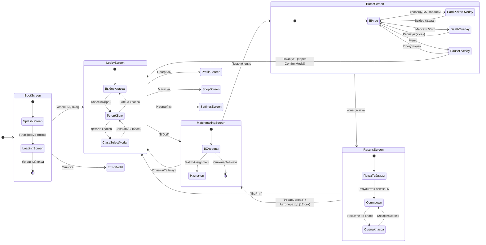

# Slime Arena — Техническое задание для UX/UI дизайнеров

**Версия:** 1.6.1  
**Дата:** 9 января 2026  
**Статус:** Согласовано  
**Источники:** GDD-UI.md, TZ-SoftLaunch-v1.4.7.md, SlimeArena-Architecture-v4.2.5, SlimeArena-ScreenMap-v1.6.1.md  

---

## Резюме изменений v1.6.1

Патч по результатам ревью DeepSeek:

1. **CTA → «Главная кнопка действия»:** устранён англицизм в глоссарии и описаниях.
2. **Ссылки на v1.5 → v1.6.1:** обновлены все ссылки на ScreenMap.
3. **Источник таймаутов:** исправлен на v1.6 §3.

---

## Резюме изменений v1.6

Финальные правки по результатам ревью DeepSeek:

1. **Ссылка на платформы:** исправлен источник `§1.3` → `§2.1` (TZ-SoftLaunch).
2. **Кнопка «Играть снова»:** унифицировано название во всех диаграммах (было «Ещё раз»).
3. **Consent/DataDeletion:** подтверждено явное отображение в `SettingsScreen` — согласия (только чтение) и кнопка удаления данных с `InfoModal`.

---

## Резюме изменений v1.5

Документ синхронизирован со ScreenMap v1.5. Устранены все P0-противоречия:

1. **Boot-флоу:** `BootScreen` — единый макет для `SplashScreen` и `LoadingScreen`.
2. **ResultsScreen:** [MUST] кнопка «Играть снова» и выбор класса восстановлены.
3. **Боевой цикл:** автопереход ведёт в `MatchmakingScreen`, не напрямую в `BattleScreen`.
4. **`paymentsEnabled=false`:** [MUST] `PlatformLimitModal`, не `ErrorModal`.
5. **Удаление данных:** [MUST] `InfoModal` с инструкцией, убрано из `ConfirmModal`.
6. **ClassSelectModal:** добавлен в диаграммы переходов.
7. **Константы таймаутов:** добавлена сводная таблица.
8. **Матрица совместимости оверлеев:** добавлена для дизайнеров.

---

## 1. Назначение документа

Техническое задание определяет функциональные требования к каждому экрану игры для проектирования пользовательского интерфейса. Документ содержит описание элементов, их поведения и ограничений.

**Целевая аудитория:** UX/UI дизайнеры, создающие макеты экранов.

---

## 2. Общие требования

### 2.1. Целевые платформы

| Платформа | Особенности | Приоритет |
|-----------|-------------|-----------|
| Мобильный браузер | Сенсорное управление, вертикальная/горизонтальная ориентация | Основная |
| Telegram Mini Apps | `iframe`, безопасные отступы, ограничения WebView | Основная |
| Браузер на ПК | Мышь и клавиатура | Вторичная |

**Источник:** TZ-SoftLaunch §2.1

### 2.2. Принципы интерфейса

| Принцип | Описание | Источник |
|---------|----------|----------|
| Одна рука | Основное управление левой рукой (джойстик), умения — правой | GDD-UI §2 |
| Минимум текста | Иконки и визуальные индикаторы вместо текстовых описаний | GDD-Core §0 |
| Без паузы | Выбор талантов и умений не останавливает игру | GDD-Core §0 |
| Антифрустрация | Быстрый респаун, понятные причины гибели | SlimeArena-ProjectBrief |
| Идемпотентность | Операции с ценностью защищены от дублирования через **operationId** | TZ §4, Архитектура §F.2 |
| Данные из конфигов | Числовые значения эффектов, цены, тексты берутся из **RuntimeConfig**, не хардкодятся | TZ §A, Архитектура §5.1 |

### 2.3. Безопасные зоны

| Область | Требование | Значение | Источник |
|---------|------------|----------|----------|
| Верхняя часть | Отступ для системной панели (статус-бар, «чёлка») | Динамически (min 24px) | Архитектура §7 |
| Нижняя часть | Отступ для системной навигации и жестов | Динамически (min 34px) | Архитектура §7 |
| Края экрана | Элементы управления не ближе к краю | 16px | Архитектура §7 |

### 2.4. Правила для WebView и iframe

| Требование | Описание | Источник |
|------------|----------|----------|
| Безопасные отступы | Динамическое определение и применение | Архитектура §7 |
| Запрет прокрутки | CSS и обработка событий во время управления | Архитектура §7 |
| Виртуальная клавиатура | Адаптация UI при появлении | Архитектура §7 |
| Кнопка «Назад» | Обработка через **ScreenManager**, без закрытия приложения | Архитектура §7 |

### 2.5. Цветовая палитра классов

| Класс | Основной цвет | Применение | Источник |
|-------|---------------|------------|----------|
| Охотник | Зелёный (#4CAF50) | Иконка, пузыри, подсветка | GDD-UI §10 |
| Воин | Красный (#F44336) | Иконка, пузыри, подсветка | GDD-UI §10 |
| Собиратель | Синий (#2196F3) | Иконка, пузыри, подсветка | GDD-UI §10 |
| Король | Золотой (#FFD700) | Корона, пузыри, свечение | GDD-Core §6 |

### 2.6. Общие состояния экранов

Каждый экран [MUST] поддерживать минимальный набор состояний:

| Состояние | Описание | Отображение |
|-----------|----------|-------------|
| `loading` | Загрузка данных | Индикатор загрузки, элементы затемнены |
| `ready` | Экран готов к взаимодействию | Полный интерфейс |
| `empty` | Нет данных для отображения | Заглушка с поясняющим текстом |
| `error` | Ошибка загрузки или операции | `ErrorModal` с действием |

**Источник:** Архитектура §5, §6

### 2.7. Производительность HUD

| Требование | Описание | Источник |
|------------|----------|----------|
| Частота обновления | HUD не обновляется на каждом тике симуляции | Архитектура §6.2 |
| Целевая частота | 5–10 обновлений в секунду для частых индикаторов | Архитектура §6.2 |
| Контроллер | Обновления через `HUDController` | Архитектура §6.2 |

### 2.8. Константы таймаутов (справочник для дизайнеров)

| Константа | Значение | Описание |
|-----------|----------|----------|
| Длительность матча | 180 сек | Общее время матча |
| Экран результатов | 12 сек | Время до автоперехода |
| Респаун | 2 сек | Время ожидания после гибели |
| Выбор карточки | 12 сек | Таймер автовыбора |
| Финальный отсчёт | 10 сек | Последние секунды матча |
| Очередь матчмейкинга | 180 сек | Максимальное время ожидания |
| Переподключение | 15 сек | Окно восстановления соединения |

**Источник:** ScreenMap v1.6.1 §3

---

## 3. Классификация экранов

### 3.1. Экраны мэйнфлоу (боевой цикл)

Основные экраны игрового цикла, через которые проходит каждый игрок:

| Экран | Макет | Назначение | Приоритет |
|-------|-------|------------|-----------|
| `SplashScreen` | `BootScreen` | Инициализация платформы | P0 |
| `LoadingScreen` | `BootScreen` | Авторизация, загрузка конфигов | P0 |
| `LobbyScreen` | — | Главный узел навигации | P0 |
| `MatchmakingScreen` | — | Поиск матча | P0 |
| `BattleScreen` | — | Матч с HUD и оверлеями | P0 |
| `ResultsScreen` | — | Итоги матча, выбор класса | P0 |

**Примечание:** `SplashScreen` и `LoadingScreen` визуально используют один макет `BootScreen` с разными текстами статуса.

### 3.2. Мета-экраны

Дополнительные экраны, доступные из лобби:

| Экран | Назначение | Приоритет | Видимость |
|-------|------------|-----------|-----------|
| `ProfileScreen` | Профиль игрока | P0 | Всегда |
| `ShopScreen` | Магазин | P1 | Всегда |
| `SettingsScreen` | Настройки | P1 | Всегда |
| `BattlePassScreen` | Боевой пропуск | P2 | `features.battlepass=true` |
| `LeaderboardScreen` | Рейтинги | P2 | `features.leaderboard=true` |
| `AchievementsScreen` | Достижения | P2 | `features.achievements=true` |

**Примечание:** P2 экраны [MUST] скрываться из навигации при отключённых feature flags.

---

## 4. Диаграмма переходов

### 4.1. Обзорная схема

```
┌─────────────────────────────────────────────────────────────────┐
│                        ИНИЦИАЛИЗАЦИЯ                            │
│  [Запуск] → [BootScreen] → [Авторизация] → [RuntimeConfig]      │
│              (SplashScreen + LoadingScreen)                      │
└─────────────────────────────┬───────────────────────────────────┘
                              │ успех
                              ▼
┌─────────────────────────────────────────────────────────────────┐
│                          МЕТА-ИГРА                              │
│                                                                 │
│   ┌──────────┐    ┌──────────┐    ┌──────────┐                 │
│   │ Профиль  │◄──►│  ЛОББИ   │◄──►│ Магазин  │                 │
│   └──────────┘    │ (центр)  │    └──────────┘                 │
│                   └────┬─────┘                                  │
│   ┌──────────┐         │         ┌──────────┐                  │
│   │Настройки │◄────────┼────────►│ Пропуск  │                  │
│   └──────────┘         │         └──────────┘                  │
│                        │                                        │
│   ┌──────────┐         │         ┌──────────┐                  │
│   │ Рейтинги │◄────────┴────────►│Достижения│                  │
│   └──────────┘                   └──────────┘                  │
│                                                                 │
│              ┌────────────────────────────┐                    │
│              │    ClassSelectModal        │                    │
│              │  (детальный выбор класса)  │                    │
│              └────────────────────────────┘                    │
└────────────────────────┬────────────────────────────────────────┘
                         │ "В бой"
                         ▼
┌─────────────────────────────────────────────────────────────────┐
│                       БОЕВОЙ ЦИКЛ                               │
│                                                                 │
│   [Матчмейкинг] ──► [BattleScreen] ──► [Результаты]            │
│         ▲                                    │                  │
│         │                                    │                  │
│         │◄───── авто / "Играть снова" ◄──────┤                  │
│         │                                    │                  │
│         │                                    │ "Выйти"          │
│         │                                    ▼                  │
│         └────────────────────────────────► [Лобби]             │
└─────────────────────────────────────────────────────────────────┘
```

### 4.2. Детальная диаграмма состояний



**Примечание:** Автопереход из `ResultsScreen` [MUST] вести в `MatchmakingScreen`, а не напрямую в `BattleScreen`. Это соответствует архитектуре дискретных комнат.

---

## 5. Экраны P0 (Обязательные)

### 5.1. BootScreen — Загрузка и авторизация

**Назначение:** Единый визуальный макет для `SplashScreen` и `LoadingScreen`.

**Источник:** TZ §5.1, §5.2, Архитектура §5

#### Элементы интерфейса

| Элемент | Расположение | Функция | Источник |
|---------|--------------|---------|----------|
| Логотип игры | Центр экрана | Идентификация приложения | — |
| Индикатор загрузки | Под логотипом | Визуализация процесса | TZ §5.1 |
| Текст статуса | Под индикатором | Изменяется по состоянию | TZ §5.2 |
| Версия сборки | Нижний угол | `buildVersion` для диагностики | Архитектура §4.2 |

#### Состояния (логические, на одном макете)

| Логический экран | Состояние | Текст статуса |
|------------------|-----------|---------------|
| `SplashScreen` | Инициализация | «Загрузка...» |
| `LoadingScreen` | Подключение | «Подключение к серверу...» |
| `LoadingScreen` | Авторизация | «Вход в систему...» |
| `LoadingScreen` | Загрузка конфигов | «Загрузка данных...» |
| `LoadingScreen` | Повторная попытка | «Повторное подключение...» |
| `LoadingScreen` | Ошибка | → `ErrorModal` с кнопкой «Повторить» |

#### Переходы

| Действие | Результат |
|----------|-----------|
| Успешная загрузка | Переход на `LobbyScreen` |
| Ошибка сети | `ErrorModal` → «Повторить» → повторная попытка |
| Ошибка авторизации | `ErrorModal` с пояснением |

---

### 5.2. LobbyScreen — Лобби

**Назначение:** Главный экран игры, точка входа в матч и навигация к мета-функциям.

#### Элементы интерфейса

| Элемент | Расположение | Функция | Источник |
|---------|--------------|---------|----------|
| Панель валют | Верхний правый угол | Отображение `coins` и `gems` | TZ §5.6 |
| Панель профиля | Верхний левый угол | Аватар, ник, уровень, кнопка перехода в профиль | TZ §5.3 |
| Навигационная панель | Нижняя часть | Иконки: Магазин, Пропуск, Рейтинги, Достижения, Настройки | GDD-UI §13 |
| Карточки классов | Центральная часть | Три карточки выбора класса | GDD-UI §13 |
| Кнопка «В бой» | Нижняя центральная часть | Запуск матчмейкинга (главная кнопка действия) | GDD-UI §13 |

**Правило видимости навигации:** Иконки P2-экранов [MUST] скрываться при `features.X=false`.

#### Карточка класса

| Компонент | Описание | Источник |
|-----------|----------|----------|
| Иконка класса | Силуэт слайма в цвете класса | GDD-UI §13 |
| Название | «Охотник» / «Воин» / «Собиратель» | GDD-Core §2 |
| Пассивный бонус | Текст: «+15% скорость» / «+10% урон» / «+25% сбор» | GDD-Core §2.1 |
| Стартовое умение | Иконка и название: Рывок / Щит / Притяжение | GDD-Abilities §2 |
| Состояние выбора | Подсветка рамки при выборе | — |

#### Состояния

| Состояние | Визуальное отображение |
|-----------|------------------------|
| `loading` | Индикатор загрузки, элементы затемнены |
| `ready` (класс не выбран) | Кнопка «В бой» неактивна (затемнена) |
| `ready` (класс выбран) | Карточка подсвечена, кнопка «В бой» активна |
| `error` | `ErrorModal` с действием |

#### Переходы

| Действие | Результат | Триггер |
|----------|-----------|---------|
| Нажатие на карточку класса | Открытие `ClassSelectModal` | `class_selected` |
| Нажатие «В бой» | Переход на `MatchmakingScreen` | `matchmaking_join` |
| Нажатие иконки навигации | Переход на соответствующий экран | — |

---

### 5.3. MatchmakingScreen — Поиск матча

**Назначение:** Отображение процесса поиска матча с возможностью отмены.

**Источник:** TZ §5.4

#### Элементы интерфейса

| Элемент | Расположение | Функция | Источник |
|---------|--------------|---------|----------|
| Анимация поиска | Центр экрана | Визуализация процесса подбора | TZ §5.4 |
| Таймер ожидания | Под анимацией | Время в очереди (MM:SS) | TZ §5.4 |
| Статус | Под таймером | «Поиск игроков...» / «Матч найден!» | TZ §5.4 |
| Кнопка «Отмена» | Нижняя часть | Выход из очереди | TZ §5.4 |
| Информация о классе | Верхняя часть | Иконка и название выбранного класса | — |
| Подсказка (опционально) | Нижняя часть | Случайный совет по игре | — |

#### Состояния

| Состояние | Визуальное отображение |
|-----------|------------------------|
| `queued` | Анимация поиска, таймер тикает, кнопка «Отмена» активна |
| `assigned` | Анимация успеха, статус «Матч найден!», автопереход |
| `timeout` | Сообщение «Время ожидания истекло», автовозврат в лобби |
| `error` | `ErrorModal` с действием «Повторить» или «В лобби» |

#### Анимация поиска

| Параметр | Значение |
|----------|----------|
| Тип | Пульсирующие круги или вращающиеся слаймы |
| Цвет | Цвет выбранного класса |
| Длительность цикла | 2-3 секунды |

#### Переходы

| Действие | Результат | Триггер |
|----------|-----------|---------|
| Получен `MatchAssignment` | Переход на `BattleScreen` | `matchmaking_assigned` |
| Нажатие «Отмена» | Возврат в `LobbyScreen` | `matchmaking_cancel` |
| Истечение времени (180 сек) | Возврат в `LobbyScreen` | `matchmaking_timeout` |

---

### 5.4. BattleScreen — Матч

**Назначение:** Основной игровой экран с HUD и оверлеями.

**Источник:** GDD-UI §1

#### 5.4.1. Элементы HUD

| Элемент | Расположение | Функция | Источник |
|---------|--------------|---------|----------|
| Масса и уровень | Левый верхний угол | Число кг и полоса до следующего уровня | GDD-UI §1.1 |
| Мини-карта | Правый верхний угол | Границы карты, сундуки, Король, безопасные зоны | GDD-UI §4 |
| Умения | Нижний правый угол | 1-3 иконки с перезарядкой | GDD-UI §3 |
| Джойстик | Нижний левый угол | Адаптивный, появляется под пальцем | GDD-UI §2 |
| Карточки выбора | Правый край, середина | При наличии выбора | GDD-UI §6 |
| Индикатор очереди | Над умениями | Количество отложенных выборов | GDD-UI §7 |
| Таймер матча | Верхняя часть, центр | Оставшееся время (MM:SS) | GDD-UI §1.1 |
| Счётчик убийств | Под таймером | Число убийств игрока | GDD-UI §1.1 |
| Индикатор усилений | Рядом с массой | Иконки активных усилений с таймерами | GDD-UI §11 |

#### 5.4.2. Индикатор массы и уровня

| Компонент | Описание | Источник |
|-----------|----------|----------|
| Число массы | Текущая масса в кг (например, «247 кг») | GDD-Core §3 |
| Полоса прогресса | Заполнение до следующего уровня | GDD-Core §5.1 |
| Номер уровня | Текущий уровень (1-7+) | GDD-Core §5.1 |

#### 5.4.3. Мини-карта

| Компонент | Описание | Источник |
|-----------|----------|----------|
| Границы карты | Прямоугольник арены | GDD-UI §4.1 |
| Метка игрока | Центрированная точка или стрелка | GDD-UI §4.1 |
| Границы видимости | Прямоугольник вокруг игрока | GDD-UI §4.1 |
| Сундуки | Иконки сундуков (видны всем) | GDD-UI §4.1, GDD-Chests §3.1 |
| Метка Короля | Корона (игрок с наибольшей массой) | GDD-UI §4.1, GDD-Core §6 |
| Безопасные зоны | Зелёные области (в финале) | GDD-UI §4.1, GDD-Arena §4 |
| Цветные зоны | Области эффектов (Нектар, Лёд, Лава) | GDD-Arena §2 |

**Размер:** ~15% ширины экрана, полупрозрачный фон.

#### 5.4.4. Индикатор умения

| Компонент | Описание | Источник |
|-----------|----------|----------|
| Иконка умения | Визуальное представление умения | GDD-UI §3.1 |
| Стоимость | Процент массы (например, «3%») | GDD-UI §3.1 |
| Полоса перезарядки | Заполнение по часовой стрелке | GDD-UI §3.2 |
| Состояние «Готово» | Яркая иконка, полная полоса | GDD-UI §3.2 |
| Состояние «Перезарядка» | Затемнённая иконка, полоса заполняется | GDD-UI §3.2 |
| Состояние «Недостаточно массы» | Красная рамка | GDD-UI §3.2 |

**Расстояние между иконками:** достаточное для касания без промахов (минимум 48 пикселей).

**Доступность слотов по уровням:**

| Слот | Уровень | Источник |
|------|---------|----------|
| Слот 1 | Сразу (классовое умение) | GDD-Core §5.2 |
| Слот 2 | Уровень 3 (300 кг) | GDD-Core §5.2 |
| Слот 3 | Уровень 5 (800 кг) | GDD-Core §5.2 |

#### 5.4.5. Джойстик

| Параметр | Значение | Источник |
|----------|----------|----------|
| Тип | Адаптивный (появляется под пальцем) | GDD-UI §2.1 |
| Зона активации | Левая нижняя четверть экрана | GDD-UI §2.2 |
| Радиус внешнего круга | ~80-100 пикселей | GDD-UI §2.2 |
| Радиус внутреннего круга | ~30-40 пикселей | GDD-UI §2.2 |
| Прозрачность | 50-70% | — |

#### 5.4.6. Индикатор усилений

| Компонент | Описание | Источник |
|-----------|----------|----------|
| Иконка усиления | Ярость, Ускорение, Защита, Жадность | GDD-Chests §10 |
| Круговой таймер | Заполнение против часовой стрелки | GDD-UI §11.2 |
| Счётчик зарядов | Для Защиты и Жадности вместо таймера | GDD-UI §11.2 |
| Максимум иконок | 4 одновременных усиления | GDD-UI §11.3 |

#### 5.4.7. Переходы из BattleScreen

| Действие | Результат | Триггер | Источник |
|----------|-----------|---------|----------|
| Достигнут уровень 3 или 5 | `CardPickerOverlay` (умения) | `ability_slot_unlocked` | GDD-Core §5.2 |
| Достигнут порог таланта | `CardPickerOverlay` (таланты) | `talent_available` | GDD-Talents §7.2 |
| Масса < 50 кг | `DeathOverlay` | `player_death` | GDD-Core §3.1 |
| Нажатие меню/паузы | `PauseOverlay` | — | GDD-UI §6.2 |
| Истекло время матча | `ResultsScreen` | `match_end` | TZ §5.5 |
| Потеря соединения | `DisconnectModal` | — | Архитектура §5.3.1 |

---

### 5.5. CardPickerOverlay — Карточки выбора

**Назначение:** Выбор талантов и умений во время матча без паузы.

**Источник:** GDD-UI §6, GDD-Talents §7

#### Элементы

| Элемент | Описание | Источник |
|---------|----------|----------|
| Три карточки | Вертикально, справа экрана | GDD-UI §6.2 |
| Полупрозрачность | 50% для фона карточек | GDD-UI §6.2 |
| Ширина набора | ~20% ширины экрана | GDD-UI §6.2 |

#### Содержимое карточки

| Компонент | Описание | Источник |
|-----------|----------|----------|
| Иконка | Крупная, центр карточки | GDD-UI §6.5 |
| Название | Одна строка под иконкой | GDD-UI §6.5 |
| Эффект | Числовые значения (одна строка) | GDD-UI §6.5 |
| Рамка | Цвет по редкости: серый, синий, фиолетовый | GDD-UI §6.5, GDD-Talents §1.1 |

#### Состояния

| Состояние | Визуальное отображение | Источник |
|-----------|------------------------|----------|
| Развёрнуто | Три карточки видны, умения затемнены | GDD-UI §6.2 |
| Свёрнуто | Мигающий значок с числом в очереди | GDD-UI §6.3 |
| При уроне | Автоматическое сворачивание | GDD-UI §6.4 |

#### Индикатор очереди

| Компонент | Описание | Источник |
|-----------|----------|----------|
| Значок | Мигающий при наличии выборов | GDD-UI §7.2 |
| Число | Количество в очереди (1-3) | GDD-UI §7.2 |
| Круговой таймер | Время до автовыбора (12 сек) | GDD-UI §7.2, GDD-Talents §7.4 |

---

### 5.6. ResultsScreen — Результаты

**Назначение:** Отображение итогов матча, выбор класса для следующего матча, переход к продолжению игры.

**Источник:** GDD-UI §12, TZ §5.5

#### Элементы интерфейса

| Элемент | Расположение | Функция | Источник |
|---------|--------------|---------|----------|
| Таблица лидеров | Центральная часть | Топ-10 по массе | GDD-UI §12.1 |
| Личная статистика | Под таблицей | Место, масса, убийства, пузыри | GDD-UI §12.1 |
| Выделение победителя | В таблице | Золотая рамка | GDD-UI §12.1 |
| Полученные награды | Под статистикой | Валюта, опыт (если есть) | TZ §5.5 |
| Карточки классов | Центральная часть (ниже) | Выбор класса для следующего матча | GDD-UI §12.4 |
| Таймер до автостарта | Верхняя часть | Обратный отсчёт (12 сек) | GDD-UI §12.3 |
| Кнопка «Выйти» | Нижняя часть, слева | Возврат в лобби | GDD-UI §12.4 |
| Кнопка «Играть снова» | Нижняя часть, справа | Немедленный старт следующего матча | GDD-UI §12.4 |

**Примечание:** `ResultsScreen` [MUST] содержать и кнопку «Играть снова», и выбор класса. Экран функционирует как «мини-лобби» перед следующим матчем.

#### Таблица лидеров

| Столбец | Описание |
|---------|----------|
| Место | 1-10, выделение цветом (золото, серебро, бронза) |
| Ник | Имя игрока |
| Масса | Финальная масса в кг |
| Убийства | Количество убийств |

#### Личная статистика

| Показатель | Описание |
|------------|----------|
| Место | Позиция игрока в матче |
| Масса | Финальная масса |
| Убийства | Количество убийств |
| Собрано пузырей | Количество съеденных пузырей |

#### Выбор класса на результатах

| Компонент | Описание |
|-----------|----------|
| Три карточки классов | Охотник / Воин / Собиратель |
| Выделение текущего | Подсветка рамки выбранного класса |
| При нажатии | Класс меняется для следующего матча |

**Важно:** Смена класса на `ResultsScreen` [MUST] применяться к **следующему** матчу. Текущий матч уже завершён, его результаты не меняются.

#### Переходы

| Действие | Результат | Триггер |
|----------|-----------|---------|
| Нажатие «Выйти» | Переход в `LobbyScreen` | `results_exit` |
| Нажатие «Играть снова» | Переход в `MatchmakingScreen` | `results_replay` |
| Истечение таймера (12 сек) | Автопереход в `MatchmakingScreen` | `results_autostart` |
| Нажатие на карточку класса | Смена класса (на том же экране) | `class_select` |

**Примечание к боевому циклу:** По истечении `resultsDurationSec` (12 сек) или по нажатию «Играть снова» игрок [MUST] переходить на `MatchmakingScreen`, где вызывается `matchmaking/join`. Это соответствует архитектуре дискретных комнат (каждый матч — отдельная комната Colyseus).

---

### 5.7. ProfileScreen — Профиль

**Назначение:** Отображение информации об игроке и кастомизация.

**Источник:** TZ §5.3, §C.4

#### Элементы интерфейса

| Элемент | Расположение | Функция | Источник |
|---------|--------------|---------|----------|
| Аватар | Верхняя часть, центр | Изображение игрока | TZ §C.4 |
| Ник | Под аватаром | Имя игрока, кнопка редактирования | TZ §C.4 |
| Уровень | Под ником | Уровень и полоса опыта | TZ §C.4 |
| Валюты | Справа от аватара | `coins` и `gems` | TZ §C.4 |
| Статистика | Центральная часть | Всего игр, побед, рейтинг | TZ §C.10 |
| Сетка скинов | Нижняя часть | Доступные скины | TZ §C.5 |
| Кнопка «Назад» | Верхний левый угол | Возврат в лобби | — |

#### Состояния скинов

| Состояние | Отображение | Описание |
|-----------|-------------|----------|
| Активен | Выделенная рамка, галочка | Текущий выбранный скин |
| Доступен | Обычная карточка | Можно выбрать |
| Закрыт | Замок, затемнение | Не разблокирован, при нажатии — информация |

---

## 6. Экраны P1 (Критичные)

### 6.1. ShopScreen — Магазин

**Назначение:** Покупка предметов за валюту и просмотр рекламы за награду.

**Источник:** TZ §5.7, §C.6

#### Элементы интерфейса

| Элемент | Расположение | Функция | Источник |
|---------|--------------|---------|----------|
| Панель валют | Верхний правый угол | `coins` и `gems` с кнопками «+» | TZ §5.6 |
| Вкладки витрин | Верхняя часть | Переключение `catalogs` | TZ §A.4 |
| Сетка офферов | Центральная часть | Карточки товаров | TZ §A.4 |
| Кнопка «Назад» | Верхний левый угол | Возврат в лобби | — |

#### Карточка оффера

| Компонент | Описание | Источник |
|-----------|----------|----------|
| Изображение | Превью предмета или набора | TZ §A.4 |
| Название | Название оффера | TZ §A.4 |
| Цена | Иконка валюты + число или «Бесплатно (реклама)» | TZ §A.4 |
| Лимит | «Осталось: N» если есть ограничение | TZ §A.4 |
| Бейджи | «Скидка», «Новинка» | — |
| Состояние «Куплено» | Галочка, затемнение | — |

#### Сценарий «Реклама с наградой»

| Шаг | Описание | Источник |
|-----|----------|----------|
| 1 | Нажатие на оффер с ценой «Реклама» | TZ §5.8 |
| 2 | Показ рекламы через `IAdsProvider` | Архитектура §2.2 |
| 3 | Завершение → запрос `/ads/reward/claim` с `grantId` | TZ §C.7 |
| 4 | Успех → `RewardModal`, ошибка → `ErrorModal` | TZ §5.8 |

#### Переходы из магазина

| Действие | Результат | Условие |
|----------|-----------|---------|
| Покупка за валюту | `RewardModal` | Достаточно средств |
| Покупка за валюту | `ErrorModal` («Недостаточно монет») | Недостаточно средств |
| Покупка за реальные деньги | `PlatformLimitModal` | `paymentsEnabled=false` |
| Просмотр рекламы | `RewardModal` | Успешный просмотр |

**Примечание:** При `paymentsEnabled=false` [MUST] показывать `PlatformLimitModal`, не `ErrorModal`. Это не ошибка, а ограничение платформы.

---

### 6.2. SettingsScreen — Настройки

**Назначение:** Настройки звука, языка и аккаунта.

**Источник:** Архитектура §6, §F.5

#### Элементы интерфейса

| Элемент | Функция | Источник |
|---------|---------|----------|
| Переключатель звука | Вкл/Выкл звуковых эффектов | — |
| Переключатель музыки | Вкл/Выкл фоновой музыки | — |
| Выбор языка | Список языков (ru, en) | TZ §C.4 |
| Идентификатор игрока | `userId` для копирования (поддержка) | Архитектура §F.5 |
| Согласия | Просмотр `consents` (только чтение) | Архитектура §F.4 |
| Кнопка «Удалить данные» | Открытие `InfoModal` с инструкцией | Архитектура §F.5 |
| Кнопка «Назад» | Возврат в лобби | — |

#### InfoModal «Удаление данных»

| Элемент | Описание |
|---------|----------|
| Заголовок | «Удаление аккаунта» |
| Текст | «Для удаления данных обратитесь в поддержку» |
| Контакт | Email или ссылка на форму поддержки |
| Кнопка «Копировать ID» | Копирует `userId` в буфер обмена |
| Кнопка «Закрыть» | Закрытие окна |

**Примечание:** Кнопка «Удалить данные» [MUST] открывать `InfoModal` с инструкцией, а не выполнять серверную операцию удаления. Удаление данных инициируется через поддержку/платформу (Архитектура §F.5).

---

## 7. Экраны P2 (Желательные)

P2-экраны реализуются как заглушки с минимальной функциональностью для софт-лонча.

### 7.1. BattlePassScreen — Боевой пропуск

**Назначение:** Отображение сезонного прогресса и наград.

**Источник:** TZ §5.9, §C.8

#### Элементы интерфейса

| Элемент | Функция |
|---------|---------|
| Информация о сезоне | Название, даты, оставшееся время |
| Текущий уровень | Номер уровня и полоса XP |
| Горизонтальный список уровней | Прокрутка с наградами |
| Карточка уровня | Номер, награда Free, награда Premium |
| Кнопка «Забрать» | Получение доступной награды |
| Кнопка «Купить Premium» | Если `paymentsEnabled=true` |
| Кнопка «Назад» | Возврат в лобби |

#### Переходы

| Действие | Результат |
|----------|-----------|
| Нажатие «Забрать» | `RewardModal` |
| Нажатие «Купить Premium» | `PlatformLimitModal` (если `paymentsEnabled=false`) или процесс покупки |

---

### 7.2. LeaderboardScreen — Рейтинги

**Назначение:** Отображение таблиц лидеров.

**Источник:** TZ §5.10, §C.10

#### Элементы интерфейса

| Элемент | Функция |
|---------|---------|
| Вкладки режимов | Переключение между режимами/сезонами |
| Таблица рейтинга | Место, ник, рейтинг |
| Позиция игрока | Выделенная строка с текущим местом |
| Кнопка «Назад» | Возврат в лобби |

---

### 7.3. AchievementsScreen — Достижения

**Назначение:** Отображение достижений и их прогресса.

**Источник:** TZ §5.9, §C.9

#### Элементы интерфейса

| Элемент | Функция |
|---------|---------|
| Список достижений | Карточки с иконками и прогрессом |
| Карточка достижения | Иконка, название, описание, прогресс-бар |
| Состояния | `locked`, `unlocked`, `claimed` |
| Кнопка «Забрать» | Для разблокированных достижений |
| Кнопка «Назад» | Возврат в лобби |

---

## 8. Модальные окна

### 8.1. RewardModal — Награда

**Назначение:** Отображение полученных наград.

**Источник:** TZ §5.7, §5.8

#### Элементы

| Элемент | Описание |
|---------|----------|
| Заголовок | «Получено!» или название источника |
| Список наград | Иконка + название + количество для каждой награды |
| Кнопка «Забрать» | Закрытие окна |
| Анимация | Появление предметов с эффектом |

---

### 8.2. ConfirmModal — Подтверждение

**Назначение:** Подтверждение важных действий.

**Источник:** Архитектура §F

#### Элементы

| Элемент | Описание |
|---------|----------|
| Заголовок | Название действия |
| Описание | Пояснение последствий |
| Кнопка «Да» / «Подтвердить» | Выполнение действия |
| Кнопка «Отмена» | Закрытие без действия |

#### Контексты использования

| Контекст | Заголовок | Описание |
|----------|-----------|----------|
| Выход из матча | «Покинуть матч?» | «Прогресс матча будет потерян» |
| Покупка | «Подтвердить покупку?» | Название и цена |

**Примечание:** «Удаление данных» [MUST] использовать `InfoModal`, не `ConfirmModal`.

---

### 8.3. ErrorModal — Ошибка

**Назначение:** Отображение ошибок с понятным текстом и действием.

**Источник:** TZ §5.7

#### Элементы

| Элемент | Описание |
|---------|----------|
| Иконка | Красный восклицательный знак |
| Заголовок | Тип ошибки |
| Описание | Пояснение причины |
| Кнопка «Повторить» | Если операция безопасна к повтору |
| Кнопка «Назад» / «OK» | Закрытие |

#### Типы ошибок

| Тип | Заголовок | Описание | Действие |
|-----|-----------|----------|----------|
| Недостаточно валюты | «Недостаточно монет» | «Пополните баланс в магазине» | «В магазин» / «OK» |
| Сетевая ошибка | «Ошибка соединения» | «Проверьте подключение к интернету» | «Повторить» |
| Ошибка сервера | «Что-то пошло не так» | «Попробуйте позже» | «OK» |

**Примечание:** `ErrorModal` [MUST] использовать для ошибок, не для ограничений платформы. При `paymentsEnabled=false` используется `PlatformLimitModal`.

---

### 8.4. DisconnectModal — Потеря соединения

**Назначение:** Информирование о разрыве соединения и попытка переподключения.

**Источник:** Архитектура §5.3.1

#### Элементы

| Элемент | Описание |
|---------|----------|
| Иконка | Перечёркнутый сигнал Wi-Fi |
| Заголовок | «Соединение потеряно» |
| Индикатор | Анимация переподключения |
| Таймер | Визуальный прогресс (15 сек `reconnectWindowMs`) |
| Кнопка «В меню» | Возврат в лобби без ожидания |

#### Состояния

| Состояние | Отображение |
|-----------|-------------|
| Переподключение | Анимация, таймер/прогресс активен |
| Успех | Автоматическое закрытие, возврат в матч |
| Неуспех | Сообщение, автовозврат в лобби |

---

### 8.5. PlatformLimitModal — Ограничение платформы

**Назначение:** Информирование о недоступности функции на платформе.

**Источник:** TZ §A.9, Архитектура §2.2

#### Элементы

| Элемент | Описание |
|---------|----------|
| Иконка | Информационный значок |
| Заголовок | «Временно недоступно» |
| Описание | «Эта функция сейчас недоступна» |
| Кнопка «OK» | Закрытие |

#### Контексты использования

| Контекст | Заголовок | Описание |
|----------|-----------|----------|
| `paymentsEnabled=false` | «Покупки недоступны» | «Покупки за реальные деньги временно отключены» |
| `adsRewardEnabled=false` | «Реклама недоступна» | «Функция недоступна на этой платформе» |

---

### 8.6. InfoModal — Информация

**Назначение:** Отображение информационного текста без выполнения серверных операций.

**Источник:** Архитектура §F.5

#### Элементы

| Элемент | Описание |
|---------|----------|
| Заголовок | Название раздела информации |
| Текст | Пояснительный текст или инструкция |
| Дополнительные действия | Например, «Копировать ID», внешние ссылки |
| Кнопка «Закрыть» | Закрытие окна |

---

### 8.7. ClassSelectModal — Выбор класса

**Назначение:** Детальный просмотр класса и подтверждение выбора.

**Источник:** GDD-Core §2, GDD-Abilities §2

#### Элементы

| Элемент | Описание |
|---------|----------|
| Иконка класса | Крупный силуэт слайма в цвете класса |
| Название класса | Заголовок: «Охотник» / «Воин» / «Собиратель» |
| Пассивный бонус | Текст с числовым значением |
| Описание пассивки | Расширенное пояснение механики |
| Стартовое умение | Иконка, название, описание эффекта |
| Кнопка «Выбрать» | Подтверждение выбора, закрытие окна |
| Кнопка закрытия | Крестик или область вне окна |

#### Отображение по классам

| Класс | Пассивный бонус | Стартовое умение |
|-------|-----------------|------------------|
| Охотник | «+15% к скорости» | Рывок |
| Воин | «+10% к урону» | Щит |
| Собиратель | «+25% к сбору массы» | Притяжение |

#### Переходы

| Действие | Результат | Триггер |
|----------|-----------|---------|
| Нажатие «Выбрать» | Класс применён, возврат в `LobbyScreen` | `class_confirmed` |
| Нажатие вне окна | Закрытие без изменений | — |

---

## 9. Внутриматчевые оверлеи

### 9.1. DeathOverlay — Гибель

**Назначение:** Отображение при гибели игрока.

**Источник:** GDD-Core §3.1

#### Элементы

| Элемент | Описание |
|---------|----------|
| Затемнение | Полупрозрачный тёмный фон |
| Таймер респауна | Обратный отсчёт (2 сек) |
| Причина гибели | «Убит [ник]» или «Погиб от [причина]» |
| Статистика | Убийств в матче, максимальная масса |

---

### 9.2. PauseOverlay — Меню паузы

**Назначение:** Меню во время матча.

**Источник:** GDD-UI §1

#### Элементы

| Элемент | Описание |
|---------|----------|
| Полупрозрачный фон | Затемнение игрового поля |
| Кнопка «Продолжить» | Закрытие меню |
| Переключатель звука | Вкл/Выкл |
| Кнопка «Покинуть» | Открытие `ConfirmModal` |

---

### 9.3. FinalCountdownOverlay — Финальный отсчёт

**Назначение:** Визуализация последних секунд матча.

**Источник:** GDD-Core §1.3

#### Элементы

| Элемент | Описание |
|---------|----------|
| Крупный таймер | Число секунд (10, 9, 8...) |
| Пульсация | Визуальный эффект на каждую секунду |
| Цвет | Красный, нарастающая интенсивность |

---

### 9.4. Матрица совместимости оверлеев

Какие оверлеи могут отображаться одновременно в разных состояниях `BattleScreen`:

| Состояние | CardPicker | Death | Pause | FinalCountdown | Disconnect |
|-----------|:----------:|:-----:|:-----:|:--------------:|:----------:|
| `playing` | ✓ | — | ✓ | ✓ | ✓ |
| `dead` | — | ✓ | — | ✓ | ✓ |
| `cardPicking` | ✓ | — | — | ✓ | ✓ |
| `pause` | — | — | ✓ | — | ✓ |
| `reconnecting` | — | — | — | — | ✓ |

**Легенда:** ✓ — разрешено, — — запрещено

**Приоритет оверлеев (от высшего к низшему):**

1. `DisconnectModal` — блокирует всё
2. `PauseOverlay` — блокирует ввод
3. `DeathOverlay` — частично блокирует
4. `CardPickerOverlay` — не блокирует
5. `FinalCountdownOverlay` — не блокирует

---

## 10. Уведомления

**Источник:** GDD-UI §8

### 10.1. Типы уведомлений

| Событие | Отображение | Длительность | Приоритет |
|---------|-------------|--------------|-----------|
| Гибель | Текст и затемнение | 0.5 сек | 1 (высший) |
| Убийство | Текст в центре «+[масса] кг» | 1 сек | 2 |
| Вне безопасной зоны | Пульсация краёв экрана | Постоянно | 3 |
| Новый уровень | Текст и звук | 1 сек | 4 |
| Получено усиление | Иконка + текст, смещение вверх | 1.5 сек | 5 |
| Получен талант | Иконка + название + эффект | 2 сек | 6 (низший) |

### 10.2. Правила отображения

| Правило | Описание |
|---------|----------|
| Очередь | Уведомления с низким приоритетом ждут |
| Наложение | Не более 2 уведомлений одновременно |
| Позиция | Центр экрана для важных, верх для информационных |

---

## 11. Визуализация на слайме

**Источник:** GDD-UI §9

### 11.1. Слои эффектов

| Слой | Порядок | Эффекты |
|------|---------|---------|
| Под спрайтом | 1 | Кольца Магнита, Притяжения |
| Свечение спрайта | 2 | Берсерк (красное) |
| Спрайт слайма | 3 | Основное тело |
| Контур спрайта | 4 | Защита (золотой), Щит (голубой) |
| Частицы вокруг | 5 | Ярость, Жадность |
| След движения | 6 | Ускорение |

### 11.2. Эффекты усилений

| Усиление | Визуальный эффект | Слой |
|----------|-------------------|------|
| Ярость | Оранжевые искры, пульсация спрайта | Частицы |
| Ускорение | Голубые линии скорости | След |
| Защита | Золотой мерцающий контур | Контур |
| Жадность | Золотые монеты вращаются | Частицы |

### 11.3. Статус Короля

| Элемент | Описание | Источник |
|---------|----------|----------|
| Корона | Над слаймом | GDD-UI §10.3 |
| Золотое свечение | Контур спрайта | GDD-UI §10.3 |
| Видимость | Всем игрокам | GDD-Core §6 |

---

## 12. Автомасштабирование камеры

**Источник:** GDD-UI §5

### 12.1. Параметры

| Параметр | Значение | Источник |
|----------|----------|----------|
| Минимальный зум (100 кг) | 1.0 | GDD-UI §5.3 |
| Максимальный зум (2000+ кг) | 2.5 | GDD-UI §5.3 |
| Скорость изменения | 0.5 ед/сек | GDD-UI §5.3 |

### 12.2. Визуальная обратная связь

| Требование | Описание | Источник |
|------------|----------|----------|
| Размер слайма | Слегка растёт (не уменьшается) | GDD-UI §5.5 |
| Координатная сетка | На фоне, мельчает при отдалении | GDD-UI §5.5 |
| Плавность | Изменение за 1-2 сек | GDD-UI §5.5 |
| Боевой режим | Зум не меняется 3 сек после урона | GDD-UI §5.5 |

---

## 13. Функциональные зависимости экранов

### 13.1. Зависимости от данных

| Экран | Источник данных | Обновление по событиям |
|-------|-----------------|------------------------|
| `LobbyScreen` | `MetaServer`: профиль, валюты, `RuntimeConfig` | `wallet_updated`, `config_applied` |
| `MatchmakingScreen` | `MetaServer`: очередь, `MatchAssignment` | `matchmaking_assigned` |
| `BattleScreen` | `MatchServer`: состояние комнаты | Каждый тик (через `HUDController`) |
| `ResultsScreen` | `MetaServer`: `MatchSummary`, награды, профиль (для выбора класса) | `match_end` |
| `ProfileScreen` | `MetaServer`: профиль, инвентарь | `profile_updated` |
| `ShopScreen` | `RuntimeConfig`: `shop.json`, `economy.json` | `config_applied` |
| `BattlePassScreen` | `RuntimeConfig`: `battlepass.json` | `battlepass_level_up` |
| `LeaderboardScreen` | `MetaServer`: `player_ratings` | — |
| `AchievementsScreen` | `MetaServer`: достижения | `achievement_unlock` |

### 13.2. Зависимости от конфигураций

| Экран | Конфигурации | Источник |
|-------|--------------|----------|
| `ShopScreen` | `shop.json`, `economy.json` | TZ §A.3, §A.4 |
| `BattlePassScreen` | `battlepass.json` | TZ §A.5 |
| `MatchmakingScreen` | `matchmaking.json` | TZ §A.8 |
| Все экраны | `features.json` (переключатели) | TZ §A.9 |

---

## 14. Адаптация под платформы

### 14.1. Telegram Mini Apps

| Особенность | Решение |
|-------------|---------|
| Верхняя панель Telegram | Увеличенный отступ сверху |
| Кнопка «Назад» | Интеграция с `ScreenManager` |
| Ограничение размера | Оптимизация под малые экраны |

### 14.2. Режим iframe

| Особенность | Решение |
|-------------|---------|
| Безопасные отступы | Динамическое определение |
| Запрет прокрутки | CSS и обработка событий |
| Виртуальная клавиатура | Адаптация UI при появлении |

---

## Глоссарий

| Термин | Описание |
|--------|----------|
| **HUD** | Head-Up Display — элементы интерфейса поверх игрового поля |
| **Оверлей** | Полупрозрачный слой поверх основного экрана, не блокирует симуляцию |
| **Модальное окно** | Окно, блокирующее взаимодействие с основным экраном |
| **Адаптивный джойстик** | Джойстик, появляющийся в точке касания |
| **Безопасная зона** | Область экрана, не перекрываемая системными элементами |
| **Главная кнопка действия** | Основная кнопка экрана, определяющая целевое действие пользователя |
| **coins** | Мягкая валюта игры |
| **gems** | Премиальная валюта игры |
| **operationId** | Идентификатор операции для идемпотентности |
| **grantId** | Идентификатор награды за рекламу из `economy.json` |
| **MatchAssignment** | Данные подключения к матчу (`roomId`, `matchServerUrl`, `joinToken`) |
| **MatchSummary** | Итоги матча, применяемые к профилю на `MetaServer` |
| **RuntimeConfig** | Активный набор конфигураций игры |
| **ScreenManager** | Система навигации по стеку экранов и модальных окон |
| **BootScreen** | Визуальный макет для системных экранов (`SplashScreen`, `LoadingScreen`) |
| **InfoModal** | Модальное окно с информацией без серверных операций |
| **PlatformLimitModal** | Модальное окно для ограничений платформы (не ошибок) |
| **Экраны мэйнфлоу** | Основные экраны боевого цикла |
| **Мета-экраны** | Дополнительные экраны, доступные из лобби |
| **P0, P1, P2** | Приоритеты реализации (0 — обязательно, 2 — желательно) |

---

## Связанные документы

- [GDD-Core.md](GDD-Core.md) — основные правила игры
- [GDD-UI.md](GDD-UI.md) — детальное описание интерфейса
- [GDD-Talents.md](GDD-Talents.md) — система талантов и карточек
- [TZ-SoftLaunch-v1.4.7.md](TZ-SoftLaunch-v1.4.7.md) — требования софт-лонча
- [SlimeArena-Architecture-v4.2.5](SlimeArena-Architecture-v4.2.5-Part1.md) — архитектура системы
- [SlimeArena-ScreenMap-v1.6.1.md](SlimeArena-ScreenMap-v1.6.1.md) — карта экранов и навигации

---

## История изменений

### Версия 1.6.1 (9 января 2026)

Патч по результатам ревью DeepSeek:

1. **CTA → «Главная кнопка действия»:** устранён англицизм в глоссарии и описаниях
2. **Источник таймаутов:** исправлен `§2.8` — ScreenMap v1.5 → v1.6.1
3. **Связанные документы:** обновлена ссылка ScreenMap v1.5 → v1.6.1

### Версия 1.6 (9 января 2026)

Финальные правки по результатам ревью DeepSeek:

1. **Ссылка на платформы:** исправлен источник `TZ-SoftLaunch §1.3` → `§2.1`
2. **Кнопка «Играть снова»:** унифицировано название во всех диаграммах (было «Ещё раз»)
3. **Consent/DataDeletion:** подтверждено явное отображение в `SettingsScreen` (вариант A)
4. **Синхронизация:** обновлены ссылки на ScreenMap v1.6

### Версия 1.5 (9 января 2026)

Синхронизация со ScreenMap v1.5. Устранение всех P0-противоречий:

**P0-1 — Boot-флоу:**
- `BootScreen` теперь явно указан как единый макет для `SplashScreen` и `LoadingScreen`
- Добавлена колонка «Макет» в таблицу классификации экранов
- Описаны логические состояния на одном визуальном макете

**P0-2 — ResultsScreen:**
- [MUST] Восстановлена кнопка «Играть снова»
- [MUST] Восстановлен выбор класса для следующего матча
- Автопереход [MUST] ведёт в `MatchmakingScreen`, не в `BattleScreen`
- Добавлено примечание о «мини-лобби» функциональности

**P0-3 — `paymentsEnabled=false`:**
- [MUST] `PlatformLimitModal` вместо `ErrorModal`
- Добавлены примечания в ShopScreen и ErrorModal

**P0-4 — Удаление данных:**
- [MUST] `InfoModal` с инструкцией
- Убрано «Удаление данных» из контекстов `ConfirmModal`
- Добавлен раздел 8.6 `InfoModal`

**P0-5 — ClassSelectModal:**
- Добавлен в диаграмму переходов §4.1
- Добавлен в Mermaid-диаграмму §4.2

**P1 — Дополнения:**
- Добавлена таблица констант таймаутов §2.8
- Добавлена матрица совместимости оверлеев §9.4
- Добавлены конкретные значения безопасных зон §2.3
- Обновлена ссылка на ScreenMap: v1.1 → v1.5
- Расширен глоссарий: `BootScreen`, `InfoModal`, `PlatformLimitModal`

### Версия 1.2 (9 января 2026)

Изменения по результатам ревью (Opus 4.5, ChatGPT-4o):

**Новые разделы:**
- §8.6 `ClassSelectModal` — детальный просмотр и выбор класса

**Исправления:**
- §2.2 — добавлен принцип «Данные из конфигов»
- §5.2 — стартовое умение Собирателя: «Замедление» → «Притяжение»
- §5.6 — `ResultsScreen`: удалён «Выбор класса», удалена кнопка «Ещё раз»
- §6.2 — `SettingsScreen`: «Удалить данные» показывает инструкцию

### Версия 1.1 (9 января 2026)

Изменения по результатам сравнительного анализа альтернативных версий.

### Версия 1.0 (9 января 2026)

Первоначальная версия документа.
